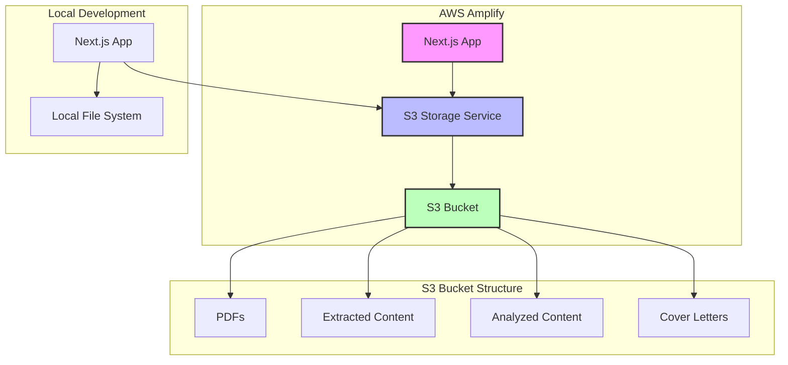
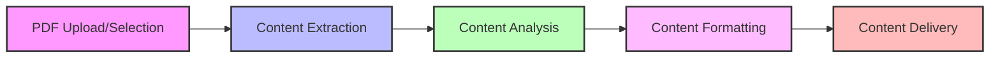
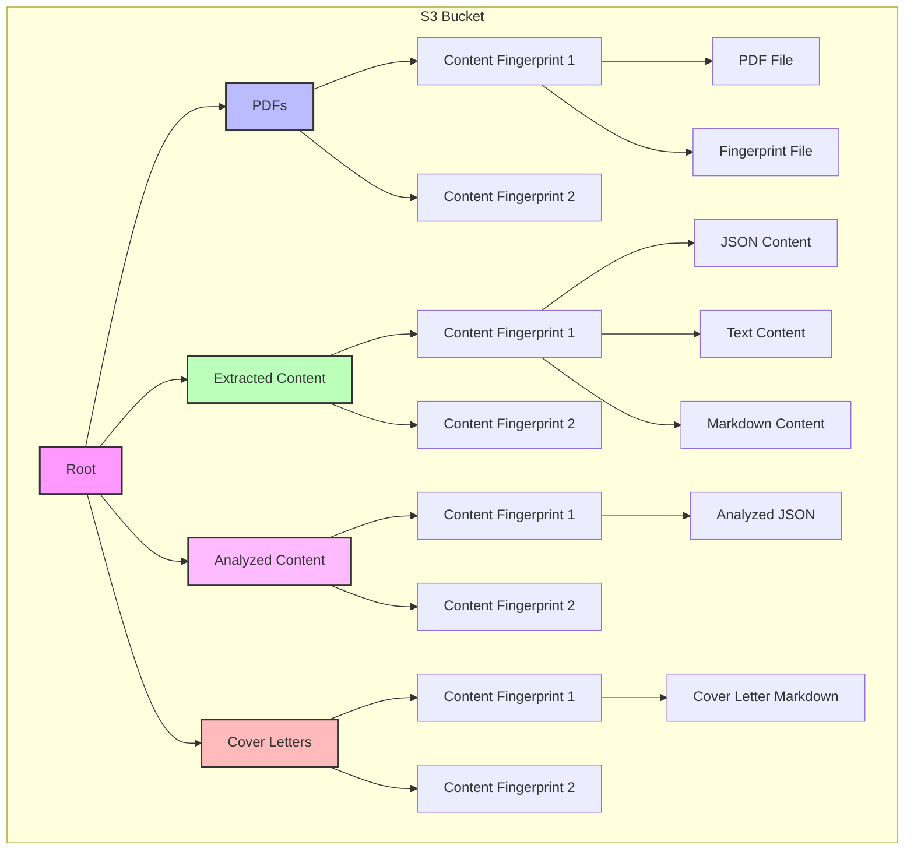
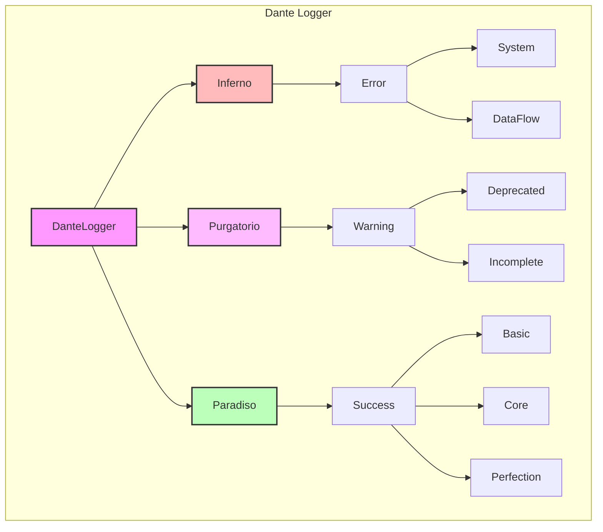

# AlexAI Architecture

This document describes the architecture of the AlexAI application, a Next.js application that extracts content from PDF files to generate summaries and downloadable markdown files.

## System Overview

AlexAI is a Next.js application deployed on AWS Amplify that processes PDF files, extracts their content, and generates various outputs such as summaries and cover letters. The application follows a philosophical approach inspired by Hesse, Salinger, Derrida, and Dante.

## Deployment Architecture

The application is deployed on AWS Amplify, which provides a serverless environment for hosting the application. In this environment, the file system is read-only, which requires special handling for file operations.

### AWS Amplify Constraints

- The file system is read-only during runtime
- The application is deployed to a `/tmp/app` directory
- Files cannot be written to the public directory during runtime

### S3 Storage Solution

To overcome the read-only file system constraints in AWS Amplify, the application uses AWS S3 for storing and retrieving PDF files and their processed content. This approach allows the application to work seamlessly in both local development and AWS Amplify environments.

## Application Components

### Core Services

1. **ContentStateService**: Manages the state of the content processing pipeline
2. **S3StorageService**: Handles interactions with AWS S3 for storing and retrieving files
3. **S3PdfProcessor**: Processes PDF files using S3 storage
4. **DanteLogger**: Provides logging functionality with different levels of severity
5. **HesseLogger**: Provides summary logging for high-level operations

### API Routes

1. **/api/cover-letter**: Generates and returns cover letter content
2. **/api/resume**: Processes and returns resume content
3. **/api/download**: Handles file downloads in various formats

## Data Flow

The application follows a data flow that processes PDF files and generates various outputs:

1. PDF Upload/Selection: The user uploads or selects a PDF file
2. Content Extraction: The PDF content is extracted and stored
3. Content Analysis: The extracted content is analyzed and structured
4. Content Formatting: The structured content is formatted for display and download
5. Content Delivery: The formatted content is delivered to the user

## S3 Storage Architecture

The S3 storage solution uses a structured approach to organize files in the S3 bucket:

1. **PDFs**: Stores the original PDF files
2. **Extracted Content**: Stores the extracted content from PDFs
3. **Analyzed Content**: Stores the analyzed and structured content
4. **Cover Letters**: Stores the generated cover letters

Each file is stored with a content fingerprint to ensure uniqueness and versioning.

## Philosophical Framework

The application follows a philosophical framework inspired by Hesse, Salinger, Derrida, and Dante:

1. **Hesse**: Balancing structure with flexibility
2. **Salinger**: Ensuring authentic representation
3. **Derrida**: Deconstructing content into structured formats
4. **Dante**: Guiding the content through different processing stages

This philosophical framework is reflected in the code structure, naming conventions, and logging system.

## Logging System

The application uses a sophisticated logging system inspired by Dante's Divine Comedy:

## Setup and Configuration

### Local Development

1. Clone the repository
2. Install dependencies: `npm install`
3. Run the development server: `npm run dev`

### AWS Amplify Deployment

1. Set up an AWS Amplify project
2. Set up an S3 bucket: `npm run env:s3`
3. Configure environment variables in AWS Amplify console:
   - `S3_BUCKET_NAME`: The name of the S3 bucket
   - `S3_REGION`: The AWS region of the S3 bucket
   - `OPENAI_API_KEY`: Your OpenAI API key
4. Deploy the application to AWS Amplify

## Conclusion

The AlexAI application uses a sophisticated architecture that combines Next.js, AWS Amplify, and S3 storage to provide a robust solution for processing PDF files and generating various outputs. The application follows a philosophical framework inspired by Hesse, Salinger, Derrida, and Dante, which is reflected in the code structure, naming conventions, and logging system.
