This is a [Next.js](https://nextjs.org) project bootstrapped with [`create-next-app`](https://nextjs.org/docs/app/api-reference/cli/create-next-app).

## Getting Started

First, run the development server:

```bash
npm run dev
# or
yarn dev
# or
pnpm dev
# or
bun dev
```

Open [http://localhost:3000](http://localhost:3000) with your browser to see the result.

You can start editing the page by modifying `app/page.tsx`. The page auto-updates as you edit the file.

This project uses [`next/font`](https://nextjs.org/docs/app/building-your-application/optimizing/fonts) to automatically optimize and load [Geist](https://vercel.com/font), a new font family for Vercel.

## Table of Contents

- [Getting Started](#getting-started)
- [Learn More](#learn-more)
- [Project Documentation](#project-documentation)
  - [Philosophical Approach](#philosophical-approach)
  - [Color Theory Legend](#philosophical-color-theory-legend)
- [Simplified Development Workflow](#simplified-development-workflow)
- [Deployment](#deployment)
  - [Local Development](#local-development)
  - [AWS Amplify Deployment](#aws-amplify-deployment)
  - [OpenAI API Key Setup](#openai-api-key-setup)

## Learn More

To learn more about Next.js, take a look at the following resources:

- [Next.js Documentation](https://nextjs.org/docs) - learn about Next.js features and API.
- [Learn Next.js](https://nextjs.org/learn) - an interactive Next.js tutorial.

You can check out [the Next.js GitHub repository](https://github.com/vercel/next.js) - your feedback and contributions are welcome!

## Project Documentation

- [Architecture Documentation](./docs/architecture/ARCHITECTURE.md) - comprehensive overview of the application architecture
- [Workflow Guide](./WORKFLOW.md) - detailed guide for the development workflow
- [Build and Run Guide](./BUILD_AND_RUN.md) - instructions for building and running the application
- [Automated Testing Guide](./AUTOMATED_TESTING.md) - guide for using the automated testing tools
- [AWS Amplify Deployment Guide](./AMPLIFY.md) - instructions for deploying to AWS Amplify
- [OpenAI API Key Setup for Amplify](./AMPLIFY_OPENAI.md) - setting up OpenAI API key for PDF analysis

### Philosophical Approach

Our application architecture is guided by four philosophical approaches, each represented by a distinct color in our diagrams:

- **Hesse Philosophy (Teal)**: Structure and balance - Applied to core services and data structures
- **Salinger Philosophy (Purple)**: Authenticity and narrative - Applied to user interfaces and experiences
- **Derrida Philosophy (Red)**: Deconstruction and analysis - Applied to content processing and caching
- **Dante Philosophy (Gold)**: Navigation and guidance - Applied to logging and error handling

#### Philosophical Color Theory Legend

```mermaid
%%{
  init: {
    'theme': 'base',
    'themeVariables': {
      'primaryColor': '#f1f4f3',
      'primaryTextColor': '#333333',
      'primaryBorderColor': '#c2d6d4',
      'lineColor': '#2eb8ac',
      'secondaryColor': '#903399',
      'tertiaryColor': '#d92635',
      'mainBkg': '#f0f0f0',
      'nodeBorder': '#999999',
      'clusterBkg': '#f0f0f0',
      'clusterBorder': '#999999',
      'edgeLabelBackground': '#ffffff',
      'titleColor': '#333333'
    }
  }
}%%

flowchart LR
    %% Simplified Legend with only Philosophical Approaches
    subgraph PhilosophicalApproaches["Philosophical Approaches"]
        direction TB
        Hesse["Hesse - Structure<br><span style='font-size:10px;color:#2eb8ac80'>structure connections</span>"]:::hesse
        Salinger["Salinger - Narrative<br><span style='font-size:10px;color:#90339980'>narrative connections</span>"]:::salinger
        Derrida["Derrida - Analysis<br><span style='font-size:10px;color:#d9263580'>analysis connections</span>"]:::derrida
        Dante["Dante - Guidance<br><span style='font-size:10px;color:#b8ac2e80'>guidance connections</span>"]:::dante
    end

    %% Ensure consistent sizing with improved centering
    style Hesse width:180px,height:60px,text-align:center
    style Salinger width:180px,height:60px,text-align:center
    style Derrida width:180px,height:60px,text-align:center
    style Dante width:180px,height:60px,text-align:center

    %% Style Definitions with centered text
    classDef hesse fill:#2eb8ac,stroke:#1D7A73,color:#FFFFFF,shape:rect,font-size:12.7px,font-weight:bold,text-align:center
    classDef salinger fill:#903399,stroke:#6D2673,color:#FFFFFF,shape:stadium,font-size:12.7px,font-weight:bold,text-align:center
    classDef derrida fill:#d92635,stroke:#A31C28,color:#FFFFFF,shape:hexagon,font-size:12.7px,font-weight:bold,text-align:center
    classDef dante fill:#b8ac2e,stroke:#7A731D,color:#FFFFFF,shape:diamond,font-size:12.7px,font-weight:bold,text-align:center

    %% Domain styling with improved containment and alignment
    classDef PhilosophicalApproaches fill:#f1f4f3,stroke:#c2d6d4,color:#444444,stroke-width:1px

    %% Apply consistent styling to subgraph with centered text
    style PhilosophicalApproaches font-weight:bold,font-size:14px,padding:10px,margin:0,text-align:center
```



For more detailed information about how these philosophical approaches are applied throughout the architecture, see the [Architecture Documentation](./docs/architecture/ARCHITECTURE.md).

## Simplified Development Workflow

The development workflow has been streamlined to two main commands:

### 1. Build and Test

```bash
npm run build
```

This consolidated build script:
- Runs linting to ensure code quality
- Cleans up previous build artifacts
- Runs the prebuild script (PDF extraction and analysis)
- Builds the application with Next.js
- Runs the postbuild script to copy extracted files
- Tests the download functionality
- Generates a detailed test report

### 2. Start and Verify

```bash
npm run start
```

This consolidated start script:
- Starts the application in production mode
- Runs basic health checks to ensure the application is working correctly
- Provides real-time feedback on the application status

For more detailed information, see the [Workflow Guide](./WORKFLOW.md).

## Deployment

### Local Development

```bash
# Development mode (for UI changes with hot reloading)
npm run dev

# Build and test (comprehensive build with testing)
npm run build

# Start and verify (start in production mode with health checks)
npm run start
```

#### Development Modes

- **Development Mode** (`npm run dev`): For UI changes and local development with hot reloading. Uses mock data for some features to avoid relying on external APIs.
- **Production Mode** (`npm run build` followed by `npm run start`): For testing the full SSR functionality with real API calls in a way that mirrors AWS Amplify deployment.

#### Running with Standalone Output

The application is configured to use `output: 'standalone'` in next.config.js, which is optimized for AWS Amplify deployment. The consolidated build and start scripts handle this automatically:

```bash
# Build the application (includes testing and validation)
npm run build

# Start the standalone server (includes health checks)
npm run start
```

The build process includes:
- Linting to ensure code quality
- Prebuild script for PDF extraction and analysis
- Next.js build
- Postbuild script to copy extracted files
- Download functionality testing
- Detailed test reporting

Note: When using `output: 'standalone'`, the standard Next.js server (`next start`) will show a warning and may not work correctly. Always use `npm run start` for the best experience.

### AWS Amplify Deployment

This project is configured for deployment on AWS Amplify. For detailed instructions, see [AMPLIFY.md](./AMPLIFY.md).

```bash
# Simulate Amplify build process locally
npm run amplify:build

# Serve the built files locally
npm run amplify:serve

# Deploy to Amplify (requires AWS credentials)
./deploy.sh pdf-next.js
```

The deployment process will:

1. Build the static site
2. Push to the specified branch
3. Trigger Amplify's CI/CD pipeline
4. Deploy to your custom domain
