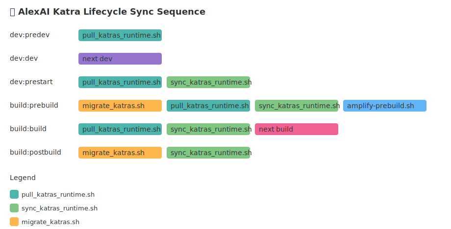

This is a [Next.js](https://nextjs.org) project bootstrapped with [`create-next-app`](https://nextjs.org/docs/app/api-reference/cli/create-next-app).

## Getting Started

First, run the development server:

```bash
npm run dev
# or
yarn dev
# or
pnpm dev
# or
bun dev
```

Open [http://localhost:3000](http://localhost:3000) with your browser to see the result.

You can start editing the page by modifying `app/page.tsx`. The page auto-updates as you edit the file.

This project uses [`next/font`](https://nextjs.org/docs/app/building-your-application/optimizing/fonts) to automatically optimize and load [Geist](https://vercel.com/font), a new font family for Vercel.

## Learn More

To learn more about Next.js, take a look at the following resources:

- [Next.js Documentation](https://nextjs.org/docs) - learn about Next.js features and API.
- [Learn Next.js](https://nextjs.org/learn) - an interactive Next.js tutorial.

You can check out [the Next.js GitHub repository](https://github.com/vercel/next.js) - your feedback and contributions are welcome!

## PDF Workflow

AlexAI includes a comprehensive PDF workflow for selecting, extracting, and processing PDF files. This workflow allows you to:

- Select PDF files from the public folder and source-pdfs directory
- Extract content, colors, and fonts from PDFs
- Test the extraction process
- Build and test the application locally
- Deploy the application to AWS

### Quick Start

To get started with the PDF workflow, run:

```bash
npm run pdf
```

This will open the PDF Manager, which provides a menu-driven interface for all PDF-related functionality.

Alternatively, you can use the `alex` command:

```bash
npx alex pdf
```

For detailed documentation, see the [PDF Workflow Documentation](./docs/pdf-workflow/README.md).

## Deployment

### Local Development

```bash
# Install dependencies
npm install

# Run development server
npm run dev

# Build for production
npm run build

# Serve production build locally
npm start
```

### PDF Selection and Testing

```bash
# Open the PDF Manager
npm run pdf

# Select a PDF file
npm run pdf:select

# Test PDF extraction
npm run test:pdf-extraction

# Build and test with the selected PDF
npm run build
npm run start
```

### AWS Amplify Deployment

This project is configured for deployment on AWS Amplify. For detailed instructions, see [AMPLIFY.md](./AMPLIFY.md).

```bash
# Simulate Amplify build process locally
npm run amplify:build

# Serve the built files locally
npm run amplify:serve

# Deploy to Amplify (requires AWS credentials)
./deploy.sh pdf-next.js

# Simulate deployment with PDF processing
npm run deploy:simulate

# Deploy to AWS with PDF processing
npm run deploy:aws
```

The deployment process will:

1. Extract content, colors, and fonts from the selected PDF
2. Build the static site with the extracted content and styling
3. Push to the specified branch
4. Trigger Amplify's CI/CD pipeline
5. Deploy to your custom domain

### 🧠 AlexAI Katra Lifecycle Sync Sequence

<!-- alexai-diagram-start -->

<!-- alexai-diagram-end -->
