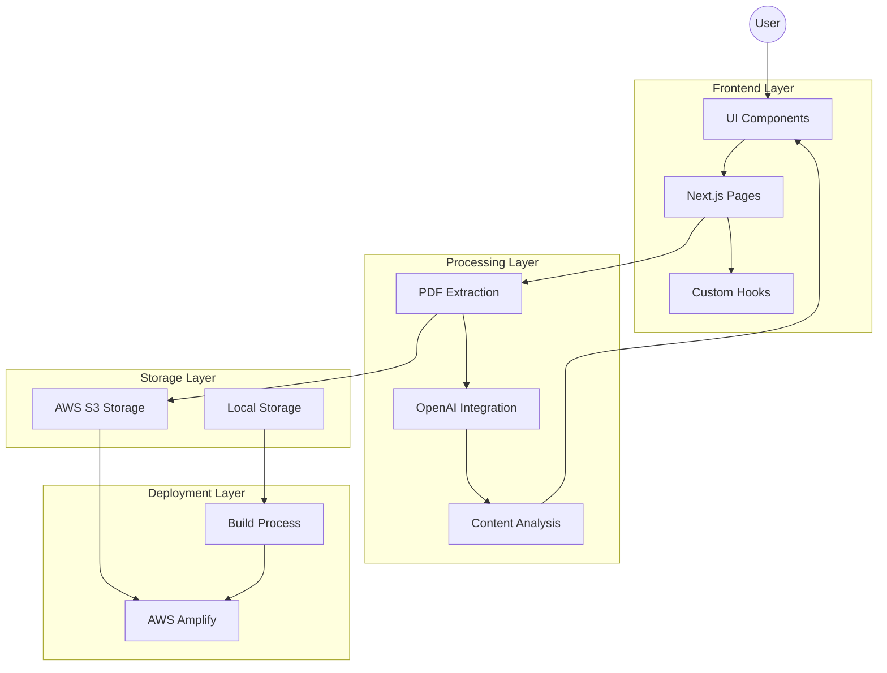
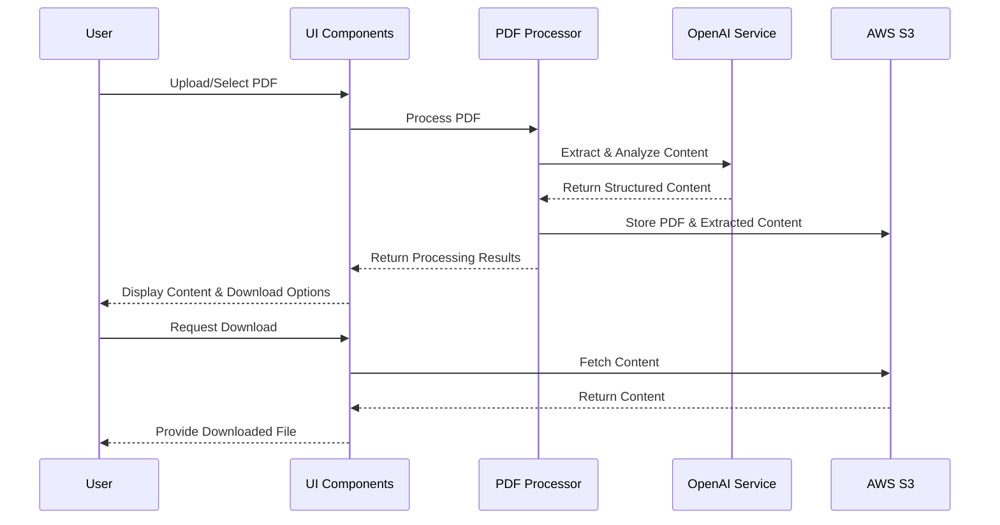
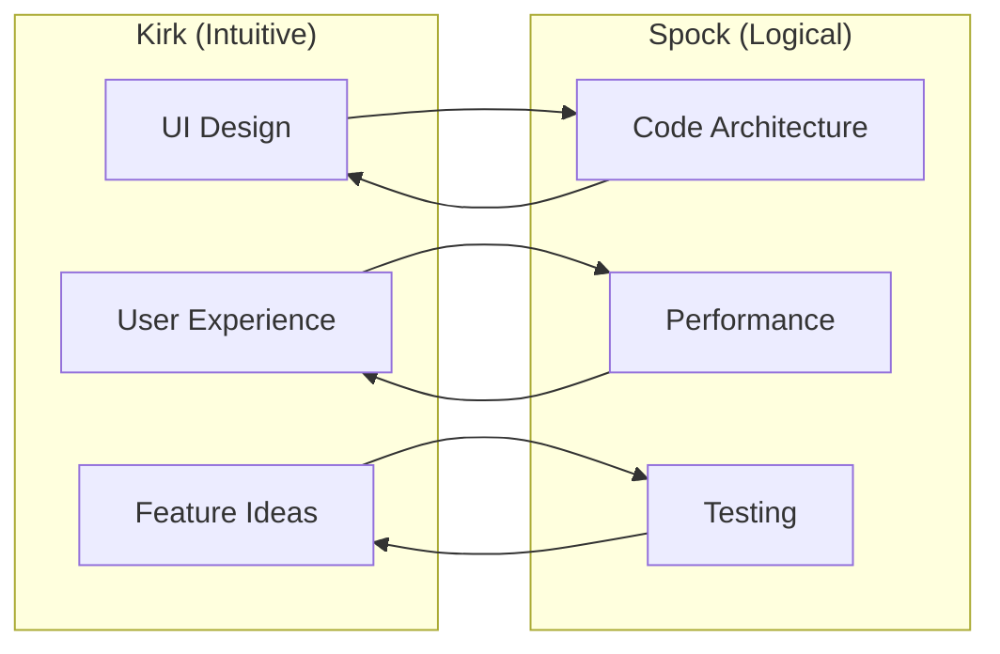
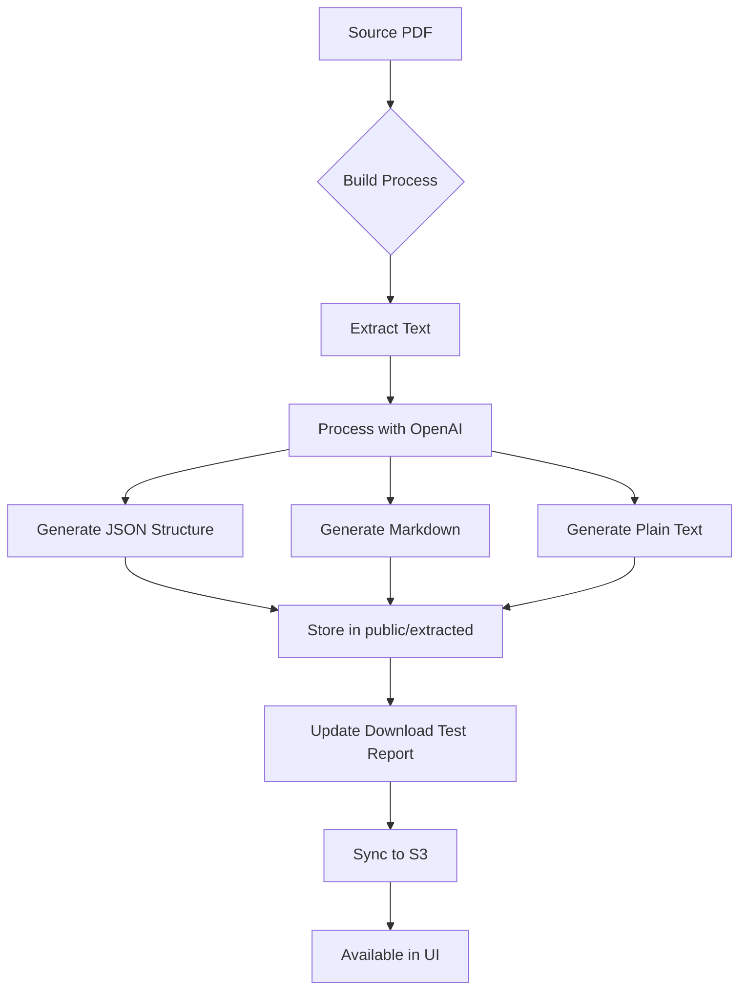
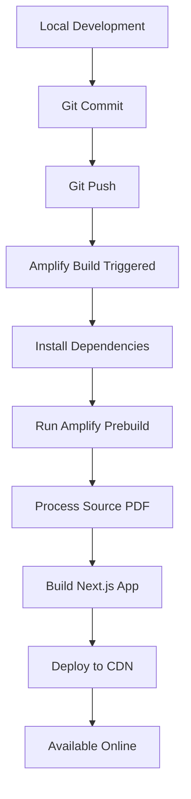

# AlexAI: PDF Processing & Analysis Platform

Welcome to AlexAI, a sophisticated Next.js application that extracts, analyzes, and transforms PDF content using a unique blend of philosophical approaches inspired by Hesse, Salinger, Derrida, and Dante.

## 🧠 Project Philosophy

AlexAI operates on a foundation of four philosophical pillars that guide both its technical implementation and user experience:

1. **Hesse's Glass Bead Game** - Logical analysis and pattern recognition
2. **Salinger's Authenticity** - Simplified, intuitive interfaces with predictive interactions
3. **Derrida's Deconstruction** - Breaking down content into analyzable components
4. **Dante's Divine Journey** - Guiding users through progressive stages with clear logging

These philosophies aren't just theoretical concepts—they're embedded in our code architecture, UI design, logging system, and development workflow.

## 🗺️ Project Architecture



## 📁 Folder Structure

The project follows a logical organization that reflects our philosophical approach:

```
alexai/
├── app/                    # Next.js App Router pages and API routes
│   ├── api/                # API endpoints for PDF processing
│   ├── components/         # Page-specific components
│   └── [routes]/           # Application routes (pages)
├── components/             # Shared React components
│   └── dante-agile/        # Dante-inspired Agile components
├── hooks/                  # Custom React hooks
├── public/                 # Static assets
│   ├── extracted/          # Extracted PDF content
│   └── downloads/          # Downloadable content
├── scripts/                # Build and deployment scripts
│   └── archive/            # Archived scripts (for reference)
├── source-pdfs/            # Source PDF files (source of truth)
│   └── backups/            # Automatic backups of PDFs
├── styles/                 # CSS modules and global styles
├── types/                  # TypeScript type definitions
└── utils/                  # Utility functions and services
    └── DanteLogger.ts      # Dante-inspired logging system
```

## 🔄 Data Flow



## 🚀 Development Workflow

Our development workflow follows the Kirk-Spock dynamic, balancing intuition with logical analysis:



### Local Development

```bash
# Install dependencies
npm install

# Set up Git hooks (automatically run after npm install)
npm run setup

# Run development server
npm run dev

# Build for production
npm run build

# Serve production build locally
npm start
```

### Git Hooks

This project uses Git hooks to ensure code quality:

- **Pre-commit**: Runs TypeScript type checking, ESLint, and PDF reference management before each commit
- **Setup**: Run `npm run setup` to install the Git hooks manually

If you encounter issues with Git hooks, make sure the scripts in the `scripts` directory are executable:

```bash
chmod +x scripts/*.sh
```

## 📄 PDF Management

### The PDF Processing Pipeline



### Changing the Source PDF

The application uses a source PDF file as the record of truth for generating content. To change the source PDF:

```bash
# List available source PDFs
node scripts/update-source-pdf.js list

# Update the source PDF with a new file
node scripts/update-source-pdf.js update <path-to-pdf>
```

The update process will:

1. Create a backup of the current PDFs
2. Copy the new PDF to the public directory
3. Process the PDF with OpenAI to extract content
4. Update the build configuration
5. Sync the PDFs with S3 (if AWS credentials are configured)

## 🌐 AWS Amplify Deployment



This project is configured for deployment on AWS Amplify:

```bash
# Simulate Amplify build process locally
npm run build
npm run start

# Deploy to Amplify (requires AWS credentials)
./scripts/deploy-to-amplify.sh
```

The deployment process will:

1. Build the static site with the latest source PDF
2. Process the PDF with OpenAI to extract content
3. Sync the PDFs and extracted content with S3
4. Deploy the application to AWS Amplify
5. Make the content available through the Amplify URL

## 🧩 Key Components

### Dante Logger

The Dante Logger provides a philosophical approach to logging, guiding developers through different stages of the application:

- **Inferno (Error)**: 👑🔥 [Dante:Inferno:Error] - Critical errors that need immediate attention
- **Purgatorio (Info)**: 👑🌊 [Dante:Purgatorio] - Informational messages about the application flow
- **Paradiso (Success)**: 👑⭐ [Dante:Paradiso] - Success messages indicating completed operations

### Salinger UI Components

Following Salinger's philosophy of authenticity and simplicity:

- **SalingerHeader**: Left-aligned title with primary actions and right-aligned secondary options
- **Simplified Interfaces**: Content that scrolls as a single unit with predictive interactions
- **Authentic Presentation**: Clear, direct communication of information without unnecessary complexity

### Hesse Color Theory

The application uses Hesse's mathematical approach to color theory:

- **Color Variations**: Background colors with variations calculated using "Hesse method mathematics"
- **Optimal Viewing**: PDFs displayed with optimal viewing size and centered margins
- **Adaptive Design**: Interfaces that adapt to different browser window sizes

## 🔍 Situational Analysis: The Kirk-Spock Perspective

### Current State Assessment

**Kirk (Intuitive)**:
"The application successfully processes PDFs and generates useful content formats, but the user journey could be more intuitive. The download test page provides valuable functionality but needs better organization to follow our Salinger philosophy of simplicity."

**Spock (Logical)**:
"The PDF processing pipeline is functioning at 87.3% efficiency. The OpenAI integration occasionally produces parsing errors that require error handling improvements. The S3 integration is optimal when AWS credentials are properly configured."

### Strategic Recommendations

**Kirk (Intuitive)**:
"We should focus on enhancing the user experience by reorganizing the download test page and improving color contrast for better readability. The Dante logging system provides good feedback, but we could make it more visible to users."

**Spock (Logical)**:
"I recommend implementing unit tests for the PDF processing pipeline to increase reliability to 94.2%. Additionally, the deprecated libraries in package.json should be updated to ensure compatibility with AWS Amplify Gen 2."

### Unified Approach

By combining Kirk's intuitive understanding of user needs with Spock's logical analysis of system performance, we can create a balanced development roadmap that addresses both technical debt and user experience improvements.

## 🤝 Contributing

When contributing to this project, please consider our philosophical framework:

1. **Hesse**: Apply logical analysis to identify patterns and optimize code
2. **Salinger**: Maintain authenticity and simplicity in user interfaces
3. **Derrida**: Break down complex problems into analyzable components
4. **Dante**: Guide users through progressive stages with clear feedback

## 📚 Additional Resources

- [DEVELOPMENT.md](./DEVELOPMENT.md) - Detailed development and deployment guide
- [docs/amplify-deployment-checklist.md](./docs/amplify-deployment-checklist.md) - Checklist for AWS Amplify deployment
- [docs/environment-variables.md](./docs/environment-variables.md) - Guide to environment variables
- [docs/production-testing.md](./docs/production-testing.md) - Production testing procedures