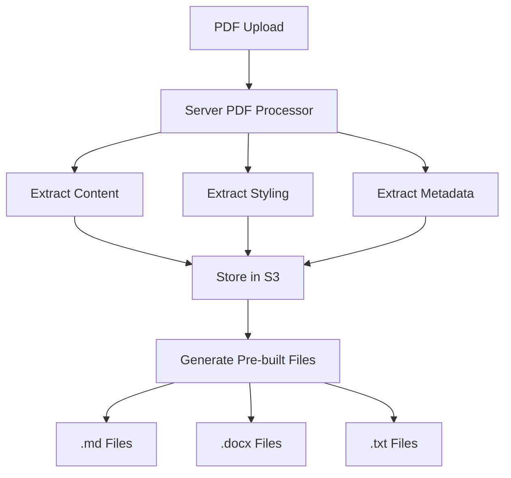
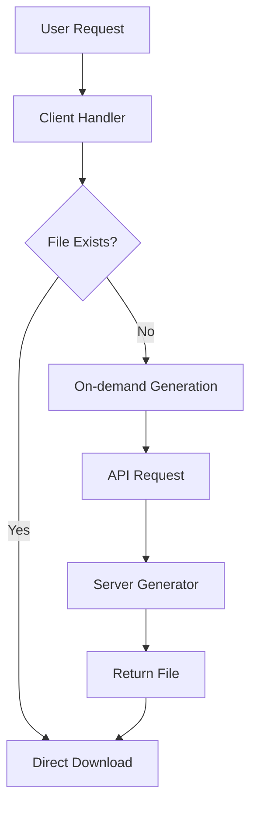

# AlexAI Component Architecture

## Overview

This document outlines the architecture for sharing components with discrete logic based on Node.js server vs. client capacities in the AlexAI application. The goal is to create a more maintainable, consistent, and efficient codebase that follows our shared philosophical frameworks.

## Core Philosophies

- **Salinger**: Intuitive UX with consistent component behavior
- **Hesse**: Mathematical harmony in component proportions and layout
- **Derrida**: Deconstruction of components into server and client parts
- **Dante**: Methodical logging across component boundaries
- **Kantian Ethics**: Professional orientation in component design
- **Müller-Brockmann**: Grid-based design with consistent component sizing

## Server vs. Client Component Architecture

### 1. Component Classification

Components should be clearly classified as one of:

- **Server Components**: Run only on the server during build or request time
- **Client Components**: Run in the browser with interactive features
- **Hybrid Components**: Server components that render client components

### 2. File Structure

```
components/
  ├── server/           # Server-only components
  │   ├── DocxGenerator.tsx
  │   ├── PdfExtractor.tsx
  │   └── ...
  ├── client/           # Client-only components
  │   ├── DocxDownloadHandler.tsx
  │   ├── PreviewModal.tsx
  │   └── ...
  └── shared/           # Shared UI components
      ├── Button.tsx
      ├── Modal.tsx
      └── ...
```

### 3. Component Naming Conventions

- Server components: `[Name]Server.tsx`
- Client components: `[Name]Client.tsx`
- Hybrid components: `[Name].tsx`

## Shared Modal System

### 1. Base Modal Component

Create a base `Modal` component in `components/shared/Modal.tsx` that:

- Uses the shared styles from `SharedModal.module.css`
- Handles common modal behaviors (open/close, positioning, animations)
- Provides consistent layout (header, body, footer)
- Adapts to PDF-extracted styling

### 2. Specialized Modal Components

Extend the base Modal component for specific use cases:

- `PreviewModal`: For previewing content in different formats
- `SummaryModal`: For displaying and downloading introduction content
- `ResumeModal`: For displaying and downloading resume content

### 3. Modal Controller

Create a `ModalController` that:

- Manages which modals are open
- Prevents multiple modals from conflicting
- Handles z-index stacking
- Provides consistent animation timing

## Document Processing Architecture

### 1. Server-Side Processing



### 2. Client-Side Processing



### 3. Shared Logic

Create utility classes that work in both environments:

- `DocumentProcessor`: Base class with shared methods
- `ServerDocumentProcessor`: Server-specific extensions
- `ClientDocumentProcessor`: Client-specific extensions

## Download Handler System

### 1. Base Download Handler

Create a base `DownloadHandler` component that:

- Handles common download behaviors
- Provides consistent UI
- Adapts to different document types

### 2. Specialized Download Handlers

Extend the base DownloadHandler for specific formats:

- `PdfDownloadHandler`: For PDF downloads
- `DocxDownloadHandler`: For DOCX downloads
- `MarkdownDownloadHandler`: For Markdown downloads
- `TextDownloadHandler`: For Text downloads

### 3. Download Service

Create a `DownloadService` that:

- Provides a unified API for all download types
- Handles fallbacks and retries
- Logs download events consistently

## API Architecture

### 1. Document-Specific Endpoints

Create dedicated endpoints for each document type:

- `/api/download-introduction-docx`: For downloading introduction DOCX
- `/api/download-resume-docx`: For downloading resume DOCX
- `/api/generate-docx`: For generating custom DOCX files

### 2. Shared Middleware

Create middleware for common API behaviors:

- `authMiddleware`: For authentication
- `loggingMiddleware`: For consistent logging
- `errorHandlingMiddleware`: For standardized error responses

### 3. API Response Format

Standardize API responses:

```typescript
interface ApiResponse<T> {
  success: boolean;
  data?: T;
  error?: string;
  meta?: {
    timestamp: string;
    requestId: string;
  };
}
```

## Implementation Plan

### Phase 1: Shared Styles and Base Components

1. Create shared style modules
2. Implement base Modal component
3. Implement base DownloadHandler component

### Phase 2: Component Refactoring

1. Refactor existing modals to use base Modal
2. Refactor download handlers to use base DownloadHandler
3. Implement ModalController

### Phase 3: Server/Client Separation

1. Reorganize components into server/client/shared folders
2. Update imports and references
3. Implement shared utility classes

### Phase 4: API Standardization

1. Create dedicated API endpoints
2. Implement shared middleware
3. Standardize API responses

## Testing Strategy

1. **Unit Tests**: Test individual components in isolation
2. **Integration Tests**: Test component interactions
3. **End-to-End Tests**: Test complete user flows
4. **Visual Regression Tests**: Ensure consistent styling

## Conclusion

By implementing this architecture, we will create a more maintainable, consistent, and efficient codebase that follows our shared philosophical frameworks. The separation of server and client components will allow us to leverage the strengths of each environment while providing a seamless user experience.
