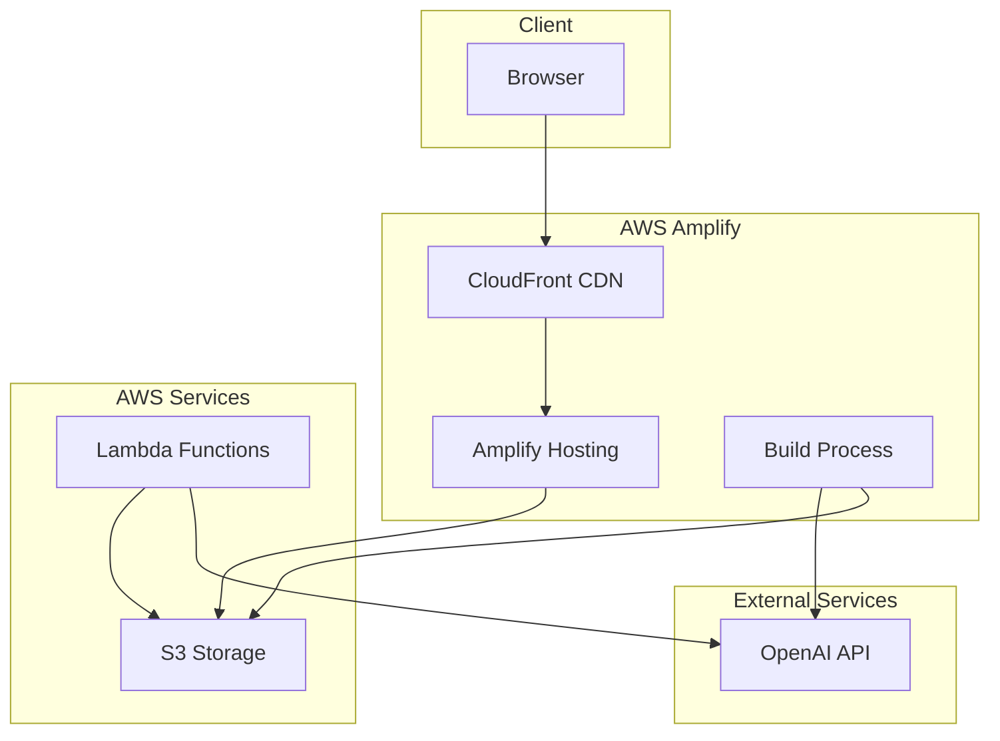
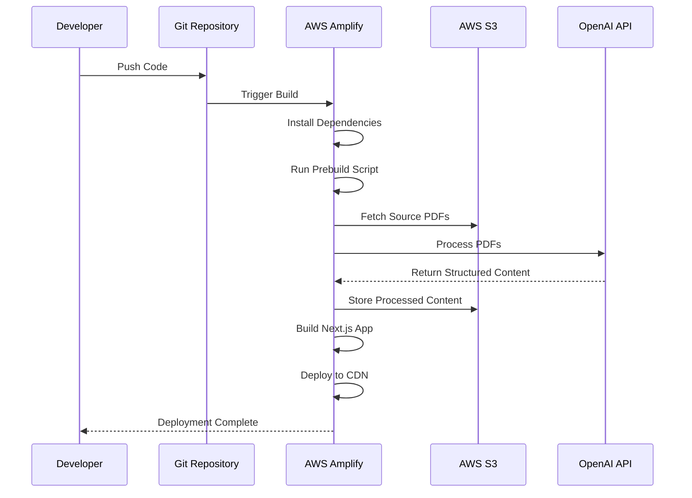

# AWS Amplify Gen2 Deployment Guide

This document provides a comprehensive guide for deploying the AlexAI application to AWS Amplify Gen2 (2025).

## Prerequisites

Before deploying to AWS Amplify Gen2, ensure you have the following:

1. **AWS Account**: An active AWS account with appropriate permissions
2. **AWS CLI**: Installed and configured with your AWS credentials
3. **Amplify CLI**: Installed globally (`npm install -g @aws-amplify/cli@latest`)
4. **Node.js**: Version 20 or later
5. **OpenAI API Key**: Valid API key for PDF processing

## Environment Setup

Set up your environment variables:

```bash
# Create a .env.local file
cat > .env.local << EOL
OPENAI_API_KEY=your_openai_api_key
NEXT_PUBLIC_OPENAI_API_KEY=your_openai_api_key
USE_OPENAI=true
S3_BUCKET_NAME=your_s3_bucket_name
EOL
```

## Local Testing

Before deploying to AWS Amplify, test the application locally:

```bash
# Install dependencies
npm install

# Run the E2E test
npm run e2e:test

# Open http://localhost:3000/download-test in your browser
```

Verify that:
- PDF processing works correctly
- Download functionality works for all formats
- UI displays correctly with proper styling

## Deployment Process

### 1. Automated Deployment

The easiest way to deploy is using the automated script:

```bash
# Deploy to AWS Amplify Gen2
npm run deploy:amplify
```

This script will:
1. Check for AWS CLI and credentials
2. Run a local build to verify everything works
3. Initialize Amplify if needed
4. Create or update the Amplify app
5. Set up environment variables
6. Create an S3 bucket for PDF storage
7. Push to the remote branch
8. Start the Amplify build

### 2. Manual Deployment

If you prefer to deploy manually:

```bash
# Initialize Amplify
amplify init

# Add hosting
amplify add hosting

# Configure environment variables
amplify update env

# Push to Amplify
amplify push
```

## S3 Integration

The application uses S3 for PDF storage:

```bash
# Sync files with S3
npm run s3:sync
```

This will:
1. Sync the `public` directory to S3 with public read access
2. Sync the `source-pdfs` directory to S3 (excluding backups)

## Monitoring and Logs

To monitor your deployment:

```bash
# Open the Amplify console
npm run logs:amplify

# Check build status
aws amplify list-jobs --app-id YOUR_APP_ID --branch-name YOUR_BRANCH_NAME
```

## Troubleshooting

### Common Issues

1. **Build Failures**:
   - Check the Amplify build logs
   - Verify environment variables are set correctly
   - Ensure AWS credentials have sufficient permissions

2. **PDF Processing Issues**:
   - Verify OpenAI API key is valid
   - Check S3 bucket permissions
   - Examine logs for OpenAI response errors

3. **S3 Access Issues**:
   - Verify bucket policy allows public read access
   - Check AWS credentials have S3 permissions
   - Ensure bucket name is correctly set in environment variables

### Deployment Checklist

- [ ] All TypeScript errors fixed or suppressed
- [ ] ESLint issues addressed
- [ ] Environment variables configured
- [ ] S3 bucket created and configured
- [ ] PDF processing tested locally
- [ ] Download functionality verified
- [ ] Amplify configuration files updated

## Architecture Diagram



## Deployment Flow



## Additional Resources

- [AWS Amplify Documentation](https://docs.aws.amazon.com/amplify/)
- [Next.js Deployment Guide](https://nextjs.org/docs/deployment)
- [S3 Bucket Policies](https://docs.aws.amazon.com/AmazonS3/latest/userguide/bucket-policies.html)
- [OpenAI API Documentation](https://platform.openai.com/docs/api-reference)
