# AlexAI Application Architecture

This document provides a comprehensive overview of the AlexAI application architecture, showing the separation of concerns and the relationships between different components.

## Application Structure Overview

> **Note**: To view this diagram in higher resolution or export it as SVG/PDF:
> 1. Open the file `docs/diagrams/viewer.html` in your browser for the Interactive Documentation Viewer
> 2. Or manually copy the Mermaid code below and visit the [Mermaid Live Editor](https://mermaid.live/)
> 3. Pre-rendered versions are available in the `docs/diagrams/` directory
>
> **VSCode Users**: Right-click on `docs/diagrams/viewer.html` and select "Open with Live Server" if you have the Live Server extension installed.

```mermaid
graph TD
    %% Main Application Areas
    Client[Client-Side Components]
    Server[Server-Side Components]
    PDF[PDF Processing]
    OpenAI[OpenAI Integration]
    Storage[Storage]
    Build[Build Process]
    Deploy[Deployment]

    %% Client-Side Components
    Client --> UI[UI Components]
    Client --> Hooks[React Hooks]
    Client --> State[State Management]
    Client --> Styles[Styling System]

    UI --> Pages[Pages]
    UI --> Components[Reusable Components]
    UI --> Layout[Layout Components]

    Pages --> HomePage[Home Page]
    Pages --> ResumePage[Resume Page]
    Pages --> IntroPage[Introduction Page]
    Pages --> AdminPage[Admin Page]

    Components --> SalingerHeader[Salinger Header]
    Components --> SummaryModal[Summary Modal]
    Components --> PDFViewer[PDF Viewer]
    Components --> ColorEditor[Color Editor]

    Hooks --> usePDF[usePDF]
    Hooks --> useIntroduction[useIntroduction]
    Hooks --> useColorTheory[useColorTheory]
    Hooks --> useFontTheory[useFontTheory]

    State --> Context[Context Providers]
    State --> LocalStorage[Local Storage]

    Context --> PDFContext[PDF Context]
    Context --> StyleContext[Style Context]
    Context --> ThemeContext[Theme Context]

    Styles --> GlobalStyles[Global Styles]
    Styles --> PDFStyles[PDF-Extracted Styles]
    Styles --> ThemeStyles[Theme Styles]
    Styles --> ComponentStyles[Component Styles]

    %% Server-Side Components
    Server --> API[API Routes]
    Server --> SSR[Server-Side Rendering]
    Server --> Middleware[Middleware]

    API --> PDFApi[PDF API]
    API --> OpenAIApi[OpenAI API]
    API --> IntroApi[Introduction API]

    SSR --> GetStaticProps[getStaticProps]
    SSR --> GetServerSideProps[getServerSideProps]

    %% PDF Processing
    PDF --> Extractor[PDF Extractor]
    PDF --> TextExtraction[Text Extraction]
    PDF --> ColorExtraction[Color Extraction]
    PDF --> FontExtraction[Font Extraction]
    PDF --> PDFGeneration[PDF Generation]

    Extractor --> CLI[CLI Tools]

    %% OpenAI Integration
    OpenAI --> Analyzer[Content Analyzer]
    OpenAI --> Prompts[Prompts]
    OpenAI --> ColorTheory[Color Theory]
    OpenAI --> FontTheory[Font Theory]

    %% Storage
    Storage --> S3[AWS S3]
    Storage --> LocalFiles[Local Files]

    %% Build Process
    Build --> Prebuild[Prebuild]
    Build --> NextBuild[Next.js Build]
    Build --> Postbuild[Postbuild]

    %% Deployment
    Deploy --> Amplify[AWS Amplify]
    Deploy --> CI[CI/CD Pipeline]

    %% Cross-Cutting Concerns
    Logging[Logging System]
    Config[Configuration]
    Utils[Utilities]

    %% Relationships
    PDFContext --> usePDF
    StyleContext --> useColorTheory
    StyleContext --> useFontTheory

    PDFApi --> Extractor
    IntroApi --> OpenAI

    Prebuild --> Extractor

    CLI --> Extractor

    Extractor --> TextExtraction
    Extractor --> ColorExtraction
    Extractor --> FontExtraction

    ColorExtraction --> ColorTheory
    FontExtraction --> FontTheory

    PDFGeneration --> IntroApi

    %% Styling with improved contrast
    classDef client fill:#f9f,stroke:#333,stroke-width:2px,color:#000,font-weight:bold;
    classDef server fill:#bbf,stroke:#333,stroke-width:2px,color:#000,font-weight:bold;
    classDef pdf fill:#fbb,stroke:#333,stroke-width:2px,color:#000,font-weight:bold;
    classDef openai fill:#bfb,stroke:#333,stroke-width:2px,color:#000,font-weight:bold;
    classDef storage fill:#fbf,stroke:#333,stroke-width:2px,color:#000,font-weight:bold;
    classDef build fill:#bff,stroke:#333,stroke-width:2px,color:#000,font-weight:bold;
    classDef deploy fill:#ffb,stroke:#333,stroke-width:2px,color:#000,font-weight:bold;
    classDef cross fill:#ddd,stroke:#333,stroke-width:2px,color:#000,font-weight:bold;

    class Client,UI,Hooks,State,Styles,Pages,Components,Layout,HomePage,ResumePage,IntroPage,AdminPage,SalingerHeader,SummaryModal,PDFViewer,ColorEditor,usePDF,useIntroduction,useColorTheory,useFontTheory,Context,LocalStorage,PDFContext,StyleContext,ThemeContext,GlobalStyles,PDFStyles,ThemeStyles,ComponentStyles client;

    class Server,API,SSR,Middleware,PDFApi,OpenAIApi,IntroApi,GetStaticProps,GetServerSideProps server;

    class PDF,Extractor,TextExtraction,ColorExtraction,FontExtraction,PDFGeneration,CLI pdf;

    class OpenAI,Analyzer,Prompts,ColorTheory,FontTheory openai;

    class Storage,S3,LocalFiles storage;

    class Build,Prebuild,NextBuild,Postbuild build;

    class Deploy,Amplify,CI deploy;

    class Logging,Config,Utils cross;
```

## Functional Areas

The application is divided into several functional areas, each with its own responsibilities:

### Client-Side Components

The client-side components handle the user interface and interaction:

- **UI Components**: Pages, reusable components, and layout components
- **React Hooks**: Custom hooks for managing state and side effects
- **State Management**: Context providers and local storage
- **Styling System**: Global styles, PDF-extracted styles, theme styles, and component styles

### Server-Side Components

The server-side components handle data processing and rendering:

- **API Routes**: Endpoints for PDF processing, OpenAI integration, and introduction generation
- **Server-Side Rendering**: getStaticProps and getServerSideProps functions
- **Middleware**: Request processing and authentication

### PDF Processing

The PDF processing components handle PDF extraction and generation:

- **PDF Extractor**: Unified interface for extracting information from PDFs
- **Text Extraction**: Extracting text content from PDFs
- **Color Extraction**: Extracting colors from PDFs
- **Font Extraction**: Extracting fonts from PDFs
- **PDF Generation**: Generating PDFs from content
- **CLI Tools**: Command-line tools for PDF management

### OpenAI Integration

The OpenAI integration components handle content analysis and generation:

- **Content Analyzer**: Analyzing PDF content using OpenAI
- **Prompts**: Prompts for OpenAI analysis
- **Color Theory**: Analyzing colors using OpenAI
- **Font Theory**: Analyzing fonts using OpenAI

### Storage

The storage components handle data persistence:

- **AWS S3**: Cloud storage for PDFs and extracted content
- **Local Files**: Local storage for development and testing

### Build Process

The build process components handle application building:

- **Prebuild**: Processing PDFs before building
- **Next.js Build**: Building the Next.js application
- **Postbuild**: Post-processing after building

### Deployment

The deployment components handle application deployment:

- **AWS Amplify**: Hosting and deployment platform
- **CI/CD Pipeline**: Continuous integration and deployment

### Cross-Cutting Concerns

The cross-cutting concerns affect multiple areas of the application:

- **Logging System**: Unified logging system following the Dante philosophy
- **Configuration**: Centralized configuration system following the Derrida philosophy
- **Utilities**: Common utility functions

## Philosophical Frameworks

The application architecture follows four philosophical frameworks:

1. **Salinger**: Intuitive user interaction and transparent code structure
2. **Hesse**: Mathematical organization and color theory
3. **Derrida**: Deconstruction of hardcoded values, replacing them with configurable options
4. **Dante**: Methodical logging and documentation

## Data Flow

The application follows a unidirectional data flow:

1. User interacts with the UI
2. UI components call hooks
3. Hooks update state through context providers
4. Context providers trigger re-renders
5. UI components reflect the updated state

For server-side operations:

1. UI components call API routes
2. API routes process the request
3. API routes call the appropriate services
4. Services return the result
5. API routes return the response
6. UI components update the state

## Build and Deployment Flow

The build and deployment process follows these steps:

1. Prebuild process extracts information from PDFs
2. Next.js build process builds the application
3. Postbuild process prepares the application for deployment
4. CI/CD pipeline deploys the application to AWS Amplify
5. AWS Amplify hosts the application
