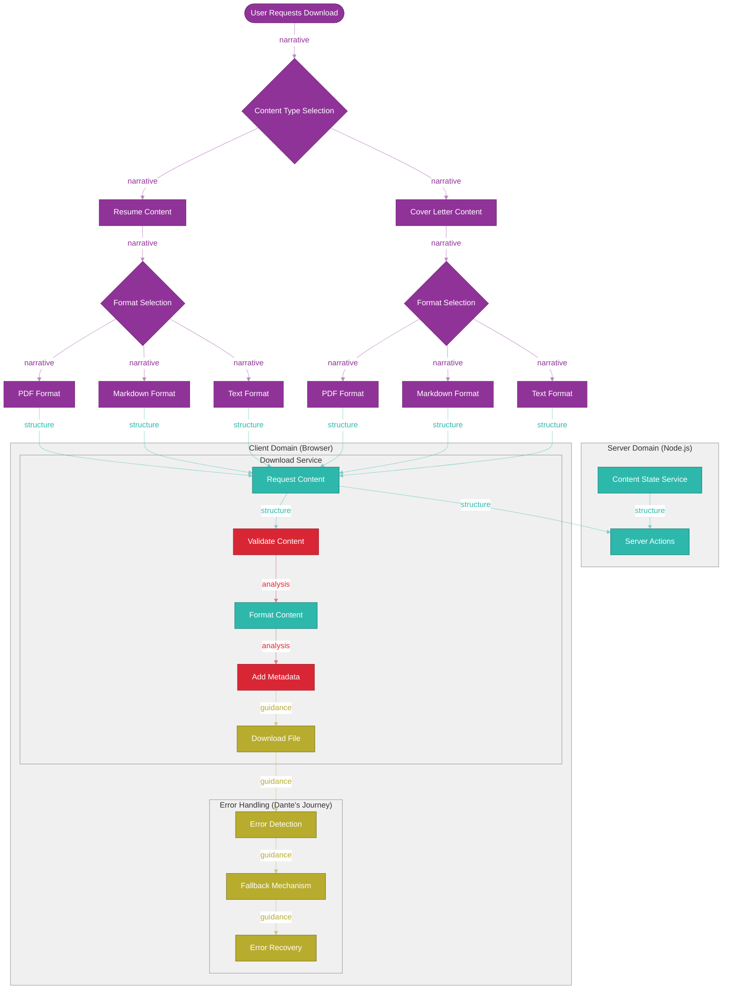
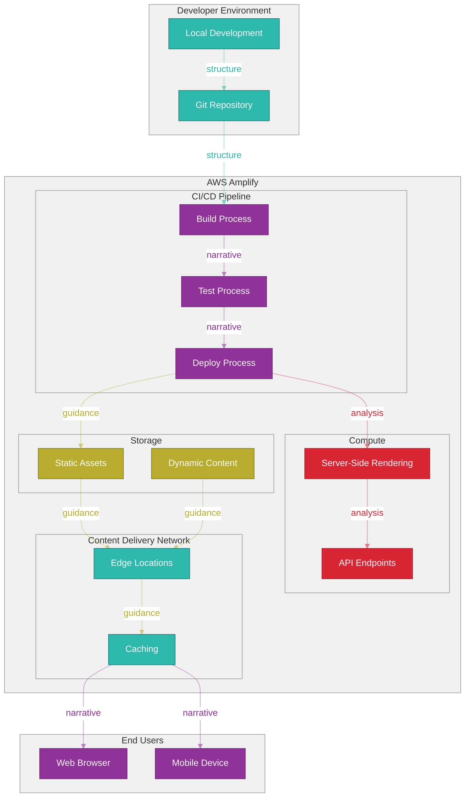

# Application Architecture Reference

This document provides a comprehensive overview of the application architecture, including visual diagrams and detailed explanations of the system components and their interactions.

## Viewing Instructions for Diagrams

### Zooming and Interacting with Diagrams
- **Zoom**: When viewing in VSCode with the Mermaid extension, you can zoom in/out using Ctrl+Scroll or Cmd+Scroll
- **Pan**: Click and drag to move around the diagram when zoomed in
- **Reset View**: Double-click to reset the zoom level

### Exporting Diagrams
To export a diagram to PDF or PNG:
1. Right-click on the diagram in VSCode
2. Select "Save diagram as PNG" or "Save diagram as SVG"
3. For PDF, you can open the SVG in a browser and print to PDF

## Table of Contents

- [Application Architecture Reference](#application-architecture-reference)
  - [Viewing Instructions for Diagrams](#viewing-instructions-for-diagrams)
    - [Zooming and Interacting with Diagrams](#zooming-and-interacting-with-diagrams)
    - [Exporting Diagrams](#exporting-diagrams)
  - [Table of Contents](#table-of-contents)
  - [Philosophical Approach](#philosophical-approach)
    - [Philosophical Color Theory Legend](#philosophical-color-theory-legend)
  - [System Overview](#system-overview)
  - [Content Processing Flow](#content-processing-flow)
  - [Download Process Flow](#download-process-flow)
  - [Server-Side Formatting](#server-side-formatting)
    - [Server-Side Formatting Implementation](#server-side-formatting-implementation)
  - [Race Condition Prevention](#race-condition-prevention)
    - [Race Condition Prevention Strategy](#race-condition-prevention-strategy)
  - [Comprehensive Architecture](#comprehensive-architecture)
    - [Comprehensive Architecture Overview](#comprehensive-architecture-overview)
  - [Component Details](#component-details)
    - [Client Components](#client-components)
    - [Server Components and Actions](#server-components-and-actions)
    - [Core Services](#core-services)
  - [Caching Strategy](#caching-strategy)
  - [Deployment Architecture](#deployment-architecture)
    - [Deployment Process](#deployment-process)
    - [Environment Variables](#environment-variables)
    - [Build Settings](#build-settings)
    - [Caching](#caching)
  - [Viewing Tips](#viewing-tips)

## Philosophical Approach

Our application architecture is guided by four philosophical approaches, each representing a distinct aspect of software design and human experience. These philosophies are not merely visual metaphors but fundamental principles that shape our code structure, user interactions, and system behavior.

### Hesse's Glass Bead Game (Teal)

**Core Principle**: Structure and Balance

Hermann Hesse's masterpiece "The Glass Bead Game" explores the pursuit of intellectual perfection through the harmonious integration of knowledge across disciplines. In our architecture:

- **Balanced Structure**: Core services maintain equilibrium between flexibility and organization
- **Harmonious Integration**: Components connect seamlessly across different domains
- **Mathematical Precision**: Algorithms and data structures follow elegant, balanced patterns
- **Intellectual Rigor**: Code organization reflects deep, thoughtful structure

### Salinger's Authenticity (Purple)

**Core Principle**: Genuine Experience and Narrative

J.D. Salinger's work, particularly "The Catcher in the Rye," emphasizes authenticity and the rejection of artifice. In our architecture:

- **Authentic Representation**: UI components present content in its most genuine form
- **Rejection of "Phoniness"**: Stale or cached data is clearly identified and refreshed
- **Direct Communication**: User interfaces favor clarity and straightforwardness
- **Human-Centered Design**: Interactions feel natural and unforced

### Derrida's Deconstruction (Red)

**Core Principle**: Analysis and Différance

Jacques Derrida's deconstructionist philosophy breaks down traditional structures to reveal hidden meanings. In our architecture:

- **Content Deconstruction**: PDF documents are broken down into constituent elements
- **Différance**: The system recognizes the space between intended and actual content states
- **Trace Analysis**: Processing leaves meaningful traces for debugging and understanding
- **Binary Opposition**: The system challenges traditional divisions between content types

### Dante's Divine Comedy (Gold)

**Core Principle**: Navigation and Guidance

Dante Alighieri's "Divine Comedy" provides a structured journey through different realms. In our architecture:

- **Guided Journey**: Users and data follow clear paths through the system
- **Hierarchical Structure**: Errors and successes are categorized by severity and importance
- **Emotional Framework**: Logging uses emojis to humanize technical processes
- **Transformative Experience**: Content undergoes a journey from raw data to refined output

These philosophical approaches inform not only the visual representation of our architecture but also the design decisions and implementation patterns throughout the codebase, creating a system that is technically sound and philosophically rich.

### Philosophical Color Theory Legend

```mermaid
%%{
  init: {
    'theme': 'base',
    'themeVariables': {
      'primaryColor': '#f1f4f3',
      'primaryTextColor': '#333333',
      'primaryBorderColor': '#c2d6d4',
      'lineColor': '#2eb8ac',
      'secondaryColor': '#903399',
      'tertiaryColor': '#d92635',
      'mainBkg': '#f0f0f0',
      'nodeBorder': '#999999',
      'clusterBkg': '#f0f0f0',
      'clusterBorder': '#999999',
      'edgeLabelBackground': '#ffffff',
      'titleColor': '#333333'
    }
  }
}%%

flowchart LR
    %% Simplified Legend with only Philosophical Approaches
    subgraph PhilosophicalApproaches["Philosophical Approaches"]
        direction TB
        Hesse["Hesse - Structure<br><span style='font-size:10px;color:#2eb8ac80'>structure connections</span>"]:::hesse
        Salinger["Salinger - Narrative<br><span style='font-size:10px;color:#90339980'>narrative connections</span>"]:::salinger
        Derrida["Derrida - Analysis<br><span style='font-size:10px;color:#d9263580'>analysis connections</span>"]:::derrida
        Dante["Dante - Guidance<br><span style='font-size:10px;color:#b8ac2e80'>guidance connections</span>"]:::dante
    end

    %% Ensure consistent sizing with improved centering
    style Hesse width:180px,height:60px,text-align:center
    style Salinger width:180px,height:60px,text-align:center
    style Derrida width:180px,height:60px,text-align:center
    style Dante width:180px,height:60px,text-align:center

    %% Style Definitions with centered text
    classDef hesse fill:#2eb8ac,stroke:#1D7A73,color:#FFFFFF,shape:rect,font-size:12.7px,font-weight:bold,text-align:center
    classDef salinger fill:#903399,stroke:#6D2673,color:#FFFFFF,shape:stadium,font-size:12.7px,font-weight:bold,text-align:center
    classDef derrida fill:#d92635,stroke:#A31C28,color:#FFFFFF,shape:hexagon,font-size:12.7px,font-weight:bold,text-align:center
    classDef dante fill:#b8ac2e,stroke:#7A731D,color:#FFFFFF,shape:diamond,font-size:12.7px,font-weight:bold,text-align:center

    %% Domain styling with improved containment and alignment
    classDef PhilosophicalApproaches fill:#f1f4f3,stroke:#c2d6d4,color:#444444,stroke-width:1px

    %% Apply consistent styling to subgraph with centered text
    style PhilosophicalApproaches font-weight:bold,font-size:14px,padding:10px,margin:0,text-align:center
```

This legend illustrates how the four philosophical approaches are represented in all diagrams throughout this document:

1. **Hesse Philosophy (Teal)**: Represents structure and balance in the system
   - Connection Type: Structure connections (teal, semi-transparent)
   - Applied to: Core services, data structures, server components

2. **Salinger Philosophy (Purple)**: Represents authenticity and narrative flow
   - Connection Type: Narrative connections (purple, semi-transparent)
   - Applied to: User interfaces, user experiences, client components

3. **Derrida Philosophy (Red)**: Represents deconstruction and analysis
   - Connection Type: Analysis connections (red, semi-transparent)
   - Applied to: Content processing, caching systems, validation

4. **Dante Philosophy (Gold)**: Represents navigation and guidance
   - Connection Type: Guidance connections (gold, semi-transparent)
   - Applied to: Logging, error handling, user guidance, results

## System Overview

The application is a Next.js application that extracts content from PDF files to generate summaries and downloadable markdown files. It follows a server-side rendering (SSR) approach for most functionality, with client-side components for user interaction.

The system is divided into two main domains:

1. **Client Domain**: Browser-based components and user interactions
2. **Server Domain**: Next.js server components, API routes, and core services

The application uses a PDF content refresher system to ensure that the displayed content is always up-to-date with the source PDF files.

## Content Processing Flow

```mermaid
%%{
  init: {
    'theme': 'base',
    'themeVariables': {
      'primaryColor': '#f1f4f3',
      'primaryTextColor': '#333333',
      'primaryBorderColor': '#c2d6d4',
      'lineColor': '#2eb8ac',
      'secondaryColor': '#903399',
      'tertiaryColor': '#d92635',
      'mainBkg': '#f0f0f0',
      'nodeBorder': '#999999',
      'clusterBkg': '#f0f0f0',
      'clusterBorder': '#999999',
      'edgeLabelBackground': '#ffffff',
      'titleColor': '#333333'
    }
  }
}%%

flowchart TB
    %% Style Definitions are in classDef section at the bottom
    %% Structure = hesse (teal), Narrative = salinger (purple)
    %% Analysis = derrida (red), Guidance = dante (gold)

    %% Process Start
    Start([User Uploads PDF]):::salinger --> |"analysis"| CheckFresh{Is Content Fresh?}:::derrida
    linkStyle 0 stroke:#d9263580,color:#d92635

    %% Content Freshness Check
    CheckFresh -->|"structure"|ExtractContent[Extract Content from PDF]:::hesse
    linkStyle 1 stroke:#2eb8ac80,color:#2eb8ac
    CheckFresh -->|"structure"|UseCache[Use Cached Content]:::hesse
    linkStyle 2 stroke:#2eb8ac80,color:#2eb8ac

    %% Content Extraction Process (Client-side)
    subgraph ExtractionProcess["Extraction Process (Browser)"]
        direction TB
        GenerateFingerprint[Generate PDF Fingerprint]:::hesse
        ExtractText[Extract Text Content]:::hesse
        ExtractStyles[Extract Styles & Colors]:::hesse
        SaveExtracted[Save Extracted Content]:::hesse

        GenerateFingerprint --> |"structure"| ExtractText
        linkStyle 3 stroke:#2eb8ac80,color:#2eb8ac
        ExtractText --> |"structure"| ExtractStyles
        linkStyle 4 stroke:#2eb8ac80,color:#2eb8ac
        ExtractStyles --> |"structure"| SaveExtracted
        linkStyle 5 stroke:#2eb8ac80,color:#2eb8ac
    end

    ExtractContent --> |"structure"| GenerateFingerprint
    linkStyle 6 stroke:#2eb8ac80,color:#2eb8ac

    %% Content Analysis Process (Server-side)
    subgraph AnalysisProcess["Analysis Process (Node.js)"]
        direction TB
        AnalyzeContent[Analyze with OpenAI]:::dante
        ValidateContent{Validate Content}:::derrida
        RetryAnalysis[Retry Analysis]:::hesse
        SaveAnalyzed[Save Analyzed Content]:::hesse

        AnalyzeContent --> |"analysis"| ValidateContent
        linkStyle 7 stroke:#d9263580,color:#d92635
        ValidateContent -->|"structure"|RetryAnalysis
        linkStyle 8 stroke:#2eb8ac80,color:#2eb8ac
        ValidateContent -->|"structure"|SaveAnalyzed
        linkStyle 9 stroke:#2eb8ac80,color:#2eb8ac
        RetryAnalysis --> |"guidance"| AnalyzeContent
        linkStyle 10 stroke:#b8ac2e80,color:#b8ac2e
    end

    SaveExtracted --> |"guidance"| AnalyzeContent
    linkStyle 11 stroke:#b8ac2e80,color:#b8ac2e

    %% Caching Process (Server-side)
    subgraph CachingProcess["Caching Process (Node.js)"]
        direction TB
        UpdateCache[Update Content Cache]:::derrida
        StoreFingerprint[Store PDF Fingerprint]:::derrida

        UpdateCache --> |"analysis"| StoreFingerprint
        linkStyle 12 stroke:#d9263580,color:#d92635
    end

    SaveAnalyzed --> |"analysis"| UpdateCache
    linkStyle 13 stroke:#d9263580,color:#d92635

    %% Content Delivery
    UseCache --> |"guidance"| DeliverContent[Deliver Content to User]:::dante
    linkStyle 14 stroke:#b8ac2e80,color:#b8ac2e
    StoreFingerprint --> |"guidance"| DeliverContent
    linkStyle 15 stroke:#b8ac2e80,color:#b8ac2e

    %% Style Definitions
    classDef hesse fill:#2eb8ac,stroke:#1D7A73,color:#FFFFFF,shape:rect
    classDef salinger fill:#903399,stroke:#6D2673,color:#FFFFFF,shape:stadium
    classDef derrida fill:#d92635,stroke:#A31C28,color:#FFFFFF,shape:hexagon
    classDef dante fill:#b8ac2e,stroke:#7A731D,color:#FFFFFF,shape:diamond

    %% Process styling
    classDef ExtractionProcess fill:#f3f1f4,stroke:#d6c2d4,color:#555555,stroke-width:2px,stroke-dasharray: 0
    classDef AnalysisProcess fill:#f1f4f3,stroke:#c2d6d4,color:#444444,stroke-width:2px,stroke-dasharray: 5
    classDef CachingProcess fill:#f1f4f3,stroke:#c2d6d4,color:#444444,stroke-width:2px,stroke-dasharray: 5
```

This diagram illustrates the content processing flow from PDF upload to content delivery, including:

1. **Content Freshness Check**: Determines if the content needs to be refreshed
2. **Content Extraction**: Extracts text, styles, and colors from the PDF
3. **Content Analysis**: Analyzes the content with OpenAI and validates it
4. **Caching**: Updates the cache and stores the PDF fingerprint
5. **Content Delivery**: Delivers the content to the user

## Download Process Flow

This diagram illustrates the consolidated download process flow for different content types and formats:

1. **Content Type Selection**: The user selects the content type (Resume or Cover Letter)
2. **Format Selection**: The user selects the format they want to download (PDF, Markdown, or Text)
3. **Content Request**: The DownloadService requests content from the ContentStateService via server actions
4. **Content Processing**: The content is validated, formatted, and metadata is added
5. **Download**: The file is downloaded in the selected format
6. **Error Handling**: Dante's journey through error detection, fallback, and recovery

The key improvements in this consolidated approach:
1. **Single Source of Truth**: ContentStateService serves as the central source for all content
2. **Unified Interface**: DownloadService provides a consistent interface for all content types and formats
3. **Server-Side Formatting**: All content formatting happens on the server for consistency
4. **Improved Error Handling**: Consistent error handling across all content types and formats

The download process embodies all four philosophical approaches:
- **Hesse (Structure)**: Balanced interfaces and format-specific processing
- **Salinger (Authenticity)**: Preserving content essence across different formats
- **Derrida (Deconstruction)**: Content transformation and metadata addition
- **Dante (Navigation)**: Guided journey through download process with error recovery

## Server-Side Formatting

```mermaid
%%{
  init: {
    'theme': 'base',
    'themeVariables': {
      'primaryColor': '#f1f4f3',
      'primaryTextColor': '#333333',
      'primaryBorderColor': '#c2d6d4',
      'lineColor': '#2eb8ac',
      'secondaryColor': '#903399',
      'tertiaryColor': '#d92635',
      'mainBkg': '#f0f0f0',
      'nodeBorder': '#999999',
      'clusterBkg': '#f0f0f0',
      'clusterBorder': '#999999',
      'edgeLabelBackground': '#ffffff',
      'titleColor': '#333333'
    }
  }
}%%

flowchart TB
    %% Style Definitions are in classDef section at the bottom
    %% Structure = hesse (teal), Narrative = salinger (purple)
    %% Analysis = derrida (red), Guidance = dante (gold)

    %% Client Domain
    subgraph ClientDomain["Client Domain (Browser JS)"]
        direction TB
        A[User Clicks Format Button]:::salinger
        B[SalingerHeader Component]:::salinger
        C[Preview Modal]:::salinger
        D[Download File]:::salinger
    end

    %% Server Domain
    subgraph ServerDomain["Server Domain (Node.js)"]
        direction TB

        %% Server Actions
        subgraph ServerActions["Server Actions"]
            direction LR
            SA1[formatContentAsMarkdown]:::hesse
            SA2[formatContentAsText]:::hesse
        end

        %% Server Components
        subgraph ServerComponents["Server Components"]
            direction LR
            SC1[ContentFormatter]:::hesse
            SC2[getFormattedContent]:::hesse
        end

        %% API Routes (Legacy)
        subgraph APIRoutes["API Routes (Legacy)"]
            direction LR
            API1["api-format-content"]:::hesse
        end

        %% Caching System
        subgraph CachingSystem["Caching System"]
            direction LR
            CS1[dynamicStringCache]:::derrida
            CS2[generateCacheKey]:::derrida
            CS3[getItem]:::derrida
            CS4[setItem]:::derrida
            CS5[clearCache]:::derrida
        end

        %% Content State Service
        subgraph ContentState["Content State Service"]
            direction LR
            CSS1[ContentStateService]:::hesse
            CSS2[getFingerprint]:::hesse
            CSS3[generateContentFingerprint]:::hesse
        end

        %% OpenAI Service
        subgraph OpenAIService["OpenAI Service"]
            direction LR
            OAI1[OpenAI Client]:::dante
            OAI2[Chat Completions]:::dante
        end
    end

    %% Connections between components
    A --> |"narrative"| B
    linkStyle 0 stroke:#90339980,color:#903399
    B --> |"structure"| SA1
    linkStyle 1 stroke:#2eb8ac80,color:#2eb8ac
    B --> |"structure"| SA2
    linkStyle 2 stroke:#2eb8ac80,color:#2eb8ac
    SA1 --> |"structure"| SC2
    linkStyle 3 stroke:#2eb8ac80,color:#2eb8ac
    SA2 --> |"structure"| SC2
    linkStyle 4 stroke:#2eb8ac80,color:#2eb8ac
    SC2 --> |"analysis"| CS1
    linkStyle 5 stroke:#d9263580,color:#d92635
    SC2 --> |"structure"| CSS2
    linkStyle 6 stroke:#2eb8ac80,color:#2eb8ac
    SC2 --> |"structure"| CSS3
    linkStyle 7 stroke:#2eb8ac80,color:#2eb8ac
    CS1 --> |"analysis"| CS2
    linkStyle 8 stroke:#d9263580,color:#d92635
    CS1 --> |"analysis"| CS3
    linkStyle 9 stroke:#d9263580,color:#d92635
    CS1 --> |"analysis"| CS4
    linkStyle 10 stroke:#d9263580,color:#d92635
    CS1 --> |"analysis"| CS5
    linkStyle 11 stroke:#d9263580,color:#d92635
    SC2 --> |"guidance"| OAI1
    linkStyle 12 stroke:#b8ac2e80,color:#b8ac2e
    OAI1 --> |"guidance"| OAI2
    linkStyle 13 stroke:#b8ac2e80,color:#b8ac2e
    SC2 --> |"narrative"| C
    linkStyle 14 stroke:#90339980,color:#903399
    SC2 --> |"narrative"| D
    linkStyle 15 stroke:#90339980,color:#903399

    %% Legacy API connections
    API1 --> |"structure"| SA1
    linkStyle 16 stroke:#2eb8ac80,color:#2eb8ac
    API1 --> |"structure"| SA2
    linkStyle 17 stroke:#2eb8ac80,color:#2eb8ac

    %% Style Definitions
    classDef salinger fill:#903399,stroke:#6D2673,color:#FFFFFF,shape:stadium
    classDef hesse fill:#2eb8ac,stroke:#1D7A73,color:#FFFFFF,shape:rect
    classDef derrida fill:#d92635,stroke:#A31C28,color:#FFFFFF,shape:hexagon
    classDef dante fill:#b8ac2e,stroke:#7A731D,color:#FFFFFF,shape:diamond

    classDef serverDomain fill:#f1f4f3,stroke:#c2d6d4,color:#444444,stroke-width:2px,stroke-dasharray: 5
    classDef clientDomain fill:#f3f1f4,stroke:#d6c2d4,color:#555555,stroke-width:2px,stroke-dasharray: 0
```

### Server-Side Formatting Implementation

The server-side formatting functionality is implemented using React Server Components and Server Actions. This approach provides several benefits:

1. **Reduced Client-Side JavaScript**: By moving the formatting logic to the server, we reduce the amount of JavaScript that needs to be sent to the client.
2. **Better Security**: API keys for OpenAI are kept on the server side.
3. **Improved Performance**: Server-side processing is more efficient and provides a better user experience.
4. **Consistent Caching**: The caching mechanism is more robust when implemented on the server side.

The implementation consists of:

- **Server Component (`ContentFormatter.tsx`)**: A React Server Component that handles the formatting of content.
- **Server Actions (`formatContentAsMarkdown`, `formatContentAsText`)**: Functions that can be called directly from client components.
- **Legacy API Route (`/api/format-content`)**: Maintained for backward compatibility with existing client code.

## Race Condition Prevention

```mermaid
%%{
  init: {
    'theme': 'base',
    'themeVariables': {
      'primaryColor': '#f1f4f3',
      'primaryTextColor': '#333333',
      'primaryBorderColor': '#c2d6d4',
      'lineColor': '#2eb8ac',
      'secondaryColor': '#903399',
      'tertiaryColor': '#d92635',
      'mainBkg': '#f0f0f0',
      'nodeBorder': '#999999',
      'clusterBkg': '#f0f0f0',
      'clusterBorder': '#999999',
      'edgeLabelBackground': '#ffffff',
      'titleColor': '#333333'
    }
  }
}%%

flowchart TB
    %% Style Definitions are in classDef section at the bottom
    %% Structure = hesse (teal), Narrative = salinger (purple)
    %% Analysis = derrida (red), Guidance = dante (gold)

    %% Client Domain
    subgraph ClientDomain["Client Domain (Browser JS)"]
        direction TB
        %% Request Entry Points
        Request1([Request 1]):::salinger
        Request2([Request 2]):::salinger
        Request3([Request 3]):::salinger
    end

    Request1 --> |"structure"| ReactCache
    linkStyle 0 stroke:#2eb8ac80,color:#2eb8ac
    Request2 --> |"structure"| ReactCache
    linkStyle 1 stroke:#2eb8ac80,color:#2eb8ac
    Request3 --> |"structure"| ReactCache
    linkStyle 2 stroke:#2eb8ac80,color:#2eb8ac

    %% Server Domain
    subgraph ServerDomain["Server Domain (Node.js)"]
        direction TB
        %% React.cache Deduplication
        subgraph ReactCache["React.cache Deduplication"]
            direction TB
            CacheCheck{In React.cache?}:::derrida
            CacheCheck -->|"structure"|ReturnCached[Return Cached Result]:::hesse
            linkStyle 3 stroke:#2eb8ac80,color:#2eb8ac
            CacheCheck -->|"structure"|ProcessRequest[Process Single Request]:::hesse
            linkStyle 4 stroke:#2eb8ac80,color:#2eb8ac
        end

        %% PDF Fingerprinting
        subgraph Fingerprinting["PDF Fingerprinting"]
            direction TB
            GetPDF[Get PDF Content]:::hesse
            GenerateHash[Generate SHA-256 Hash]:::hesse
            CompareHash{Fingerprint Changed?}:::derrida

            GetPDF --> |"structure"| GenerateHash
            linkStyle 5 stroke:#2eb8ac80,color:#2eb8ac
            GenerateHash --> |"analysis"| CompareHash
            linkStyle 6 stroke:#d9263580,color:#d92635
            CompareHash -->|"analysis"|InvalidateCache[Invalidate Cache]:::derrida
            linkStyle 7 stroke:#d9263580,color:#d92635
            CompareHash -->|"analysis"|CheckDynamicCache[Check Dynamic Cache]:::derrida
            linkStyle 8 stroke:#d9263580,color:#d92635
        end

        %% Dynamic Caching
        subgraph DynamicCaching["Dynamic Caching"]
            direction TB
            CacheKeyGen[Generate Cache Key]:::derrida
            CacheCheck2{In Dynamic Cache?}:::derrida

            CacheKeyGen --> |"analysis"| CacheCheck2
            linkStyle 9 stroke:#d9263580,color:#d92635
            CacheCheck2 -->|"analysis"|ReturnDynamicCached[Return Cached Result]:::derrida
            linkStyle 10 stroke:#d9263580,color:#d92635
            CacheCheck2 -->|"guidance"|CallOpenAI[Call OpenAI API]:::dante
            linkStyle 11 stroke:#b8ac2e80,color:#b8ac2e
            CallOpenAI --> |"analysis"| StoreInCache[Store in Cache]:::derrida
            linkStyle 12 stroke:#d9263580,color:#d92635
        end
    end

    %% Process Flow
    ProcessRequest --> |"structure"| GetPDF
    linkStyle 13 stroke:#2eb8ac80,color:#2eb8ac
    InvalidateCache --> |"analysis"| CheckDynamicCache
    linkStyle 14 stroke:#d9263580,color:#d92635
    CheckDynamicCache --> |"analysis"| CacheKeyGen
    linkStyle 15 stroke:#d9263580,color:#d92635
    ReturnDynamicCached --> |"structure"| StoreInReactCache[Store in React.cache]:::hesse
    linkStyle 16 stroke:#2eb8ac80,color:#2eb8ac
    StoreInCache --> |"structure"| StoreInReactCache
    linkStyle 17 stroke:#2eb8ac80,color:#2eb8ac

    %% Result Handling
    subgraph ResultHandling["Result Handling"]
        direction TB
        ReturnResult[Return Result to Client]:::dante
    end

    StoreInReactCache --> |"guidance"| ReturnResult
    linkStyle 18 stroke:#b8ac2e80,color:#b8ac2e
    ReturnCached --> |"guidance"| ReturnResult
    linkStyle 19 stroke:#b8ac2e80,color:#b8ac2e

    %% Style Definitions
    classDef salinger fill:#903399,stroke:#6D2673,color:#FFFFFF,shape:stadium
    classDef hesse fill:#2eb8ac,stroke:#1D7A73,color:#FFFFFF,shape:rect
    classDef derrida fill:#d92635,stroke:#A31C28,color:#FFFFFF,shape:hexagon
    classDef dante fill:#b8ac2e,stroke:#7A731D,color:#FFFFFF,shape:diamond

    %% Domain styling
    classDef ClientDomain fill:#f3f1f4,stroke:#d6c2d4,color:#555555,stroke-width:2px,stroke-dasharray: 0
    classDef ServerDomain fill:#f1f4f3,stroke:#c2d6d4,color:#444444,stroke-width:2px,stroke-dasharray: 5
    classDef ResultHandling fill:#f0f0f0,stroke:#999999,color:#444444,stroke-width:2px,stroke-dasharray: 5
```

### Race Condition Prevention Strategy

To prevent race conditions in the server-side formatting implementation, we use a multi-layered caching approach:

1. **React.cache**: We use React's built-in `cache` function to deduplicate requests. This ensures that multiple simultaneous requests for the same content are only processed once.

2. **PDF Fingerprinting**: We generate a fingerprint of the PDF content to detect changes. This fingerprint is used as part of the cache key.

3. **Dynamic Caching**: We use a dynamic caching system that is aware of the content state. When the PDF content changes, the cache is automatically invalidated.

4. **Cache Invalidation**: The cache is invalidated when:
   - The PDF content changes
   - The content is not processed
   - The content is not analyzed

This approach ensures that the system is both efficient (by caching results) and accurate (by invalidating the cache when necessary).

## Comprehensive Architecture

```mermaid
%%{
  init: {
    'theme': 'base',
    'themeVariables': {
      'primaryColor': '#f1f4f3',
      'primaryTextColor': '#333333',
      'primaryBorderColor': '#c2d6d4',
      'lineColor': '#2eb8ac',
      'secondaryColor': '#903399',
      'tertiaryColor': '#d92635',
      'mainBkg': '#f0f0f0',
      'nodeBorder': '#999999',
      'clusterBkg': '#f0f0f0',
      'clusterBorder': '#999999',
      'edgeLabelBackground': '#ffffff',
      'titleColor': '#333333'
    }
  }
}%%

flowchart TB
    %% Style Definitions are in classDef section at the bottom
    %% Structure = hesse (teal), Narrative = salinger (purple)
    %% Analysis = derrida (red), Guidance = dante (gold)

    %% Client Domain
    subgraph ClientDomain["Client Domain (Browser JS)"]
        direction TB

        %% User Actions
        subgraph UserActions["User Actions"]
            direction LR
            UA1[View Resume]:::salinger
            UA2[Request Cover Letter]:::salinger
            UA3[Format Content]:::salinger
            UA4[Download Content]:::salinger
        end

        %% Client Components
        subgraph ClientComponents["Client Components"]
            direction LR
            CC1[SalingerHeader]:::salinger
            CC2[PreviewModal]:::salinger
            CC3[SummaryModal]:::salinger
            CC4[ServerThemeProvider]:::salinger
        end

        %% Client Results
        subgraph ClientResults["Client Results"]
            direction LR
            CR1[PDF Preview]:::dante
            CR2[Markdown Preview]:::dante
            CR3[Text Preview]:::dante
            CR4[Downloaded Files]:::dante
        end
    end

    %% Server Domain
    subgraph ServerDomain["Server Domain (Node.js)"]
        direction TB

        %% Server Actions
        subgraph ServerActions["Server Actions"]
            direction LR
            SA1[formatContentAsMarkdown]:::hesse
            SA2[formatContentAsText]:::hesse
        end

        %% Server Components
        subgraph ServerComponents["Server Components"]
            direction LR
            SC1[ContentFormatter]:::hesse
            SC2[getFormattedContent]:::hesse
        end

        %% API Routes
        subgraph APIRoutes["API Routes"]
            direction LR
            API1["api-format-content"]:::hesse
            API2["api-content-state"]:::hesse
            API3["api-get-summary"]:::hesse
            API4["api-refresh-content"]:::hesse
        end

        %% Core Services
        subgraph CoreServices["Core Services"]
            direction TB

            %% Content State Service
            subgraph ContentStateService["Content State Service"]
                direction LR
                CSS1[getInstance]:::hesse
                CSS2[getFingerprint]:::hesse
                CSS3[generateContentFingerprint]:::hesse
                CSS4[isContentStale]:::hesse
                CSS5[processContent]:::hesse
            end

            %% PDF Content Processor
            subgraph PDFProcessor["PDF Content Processor"]
                direction LR
                PCP1[processPdf]:::salinger
                PCP2[extractContent]:::salinger
                PCP3[getAnalyzedContent]:::salinger
                PCP4[validateContent]:::salinger
            end

            %% Caching System
            subgraph CachingSystem["Caching System"]
                direction LR
                CS1[dynamicStringCache]:::derrida
                CS2[dynamicOpenAiCache]:::derrida
                CS3[generateCacheKey]:::derrida
                CS4[clearCache]:::derrida
            end

            %% OpenAI Service
            subgraph OpenAIService["OpenAI Service"]
                direction LR
                OAI1[OpenAI Client]:::dante
                OAI2[Chat Completions]:::dante
                OAI3[formatWithOpenAI]:::dante
            end
        end

        %% Race Condition Prevention
        subgraph RaceConditionPrevention["Race Condition Prevention"]
            direction LR
            RCP1[React.cache]:::hesse
            RCP2[PDF Fingerprinting]:::hesse
            RCP3[Cache Invalidation]:::derrida
        end
    end

    %% Connections between components
    UA1 --> |"narrative"| CC1
    linkStyle 0 stroke:#90339980,color:#903399
    UA2 --> |"narrative"| CC1
    linkStyle 1 stroke:#90339980,color:#903399
    UA3 --> |"narrative"| CC1
    linkStyle 2 stroke:#90339980,color:#903399
    UA4 --> |"narrative"| CC1
    linkStyle 3 stroke:#90339980,color:#903399

    CC1 --> |"structure"| SA1
    linkStyle 4 stroke:#2eb8ac80,color:#2eb8ac
    CC1 --> |"structure"| SA2
    linkStyle 5 stroke:#2eb8ac80,color:#2eb8ac
    CC1 --> |"structure"| API3
    linkStyle 6 stroke:#2eb8ac80,color:#2eb8ac
    CC1 --> |"structure"| API4
    linkStyle 7 stroke:#2eb8ac80,color:#2eb8ac

    SA1 --> |"structure"| SC2
    linkStyle 8 stroke:#2eb8ac80,color:#2eb8ac
    SA2 --> |"structure"| SC2
    linkStyle 9 stroke:#2eb8ac80,color:#2eb8ac

    SC2 --> |"structure"| RCP1
    linkStyle 10 stroke:#2eb8ac80,color:#2eb8ac
    SC2 --> |"analysis"| CS1
    linkStyle 11 stroke:#d9263580,color:#d92635
    SC2 --> |"structure"| CSS2
    linkStyle 12 stroke:#2eb8ac80,color:#2eb8ac

    API1 --> |"structure"| SA1
    linkStyle 13 stroke:#2eb8ac80,color:#2eb8ac
    API1 --> |"structure"| SA2
    linkStyle 14 stroke:#2eb8ac80,color:#2eb8ac

    API2 --> |"structure"| CSS1
    linkStyle 15 stroke:#2eb8ac80,color:#2eb8ac
    API2 --> |"structure"| CSS4
    linkStyle 16 stroke:#2eb8ac80,color:#2eb8ac
    API2 --> |"structure"| CSS5
    linkStyle 17 stroke:#2eb8ac80,color:#2eb8ac

    CSS5 --> |"narrative"| PCP1
    linkStyle 18 stroke:#90339980,color:#903399
    PCP1 --> |"narrative"| PCP2
    linkStyle 19 stroke:#90339980,color:#903399
    PCP1 --> |"narrative"| PCP3
    linkStyle 20 stroke:#90339980,color:#903399
    PCP1 --> |"narrative"| PCP4
    linkStyle 21 stroke:#90339980,color:#903399

    PCP3 --> |"analysis"| CS2
    linkStyle 22 stroke:#d9263580,color:#d92635
    SC2 --> |"analysis"| CS1
    linkStyle 23 stroke:#d9263580,color:#d92635

    CS1 --> |"structure"| RCP2
    linkStyle 24 stroke:#2eb8ac80,color:#2eb8ac
    CS2 --> |"structure"| RCP2
    linkStyle 25 stroke:#2eb8ac80,color:#2eb8ac
    RCP2 --> |"analysis"| RCP3
    linkStyle 26 stroke:#d9263580,color:#d92635

    SC2 --> |"guidance"| OAI1
    linkStyle 27 stroke:#b8ac2e80,color:#b8ac2e
    OAI1 --> |"guidance"| OAI2
    linkStyle 28 stroke:#b8ac2e80,color:#b8ac2e
    OAI2 --> |"guidance"| OAI3
    linkStyle 29 stroke:#b8ac2e80,color:#b8ac2e

    SC2 --> |"guidance"| CR1
    linkStyle 30 stroke:#b8ac2e80,color:#b8ac2e
    SC2 --> |"guidance"| CR2
    linkStyle 31 stroke:#b8ac2e80,color:#b8ac2e
    SC2 --> |"guidance"| CR3
    linkStyle 32 stroke:#b8ac2e80,color:#b8ac2e
    SC2 --> |"guidance"| CR4
    linkStyle 33 stroke:#b8ac2e80,color:#b8ac2e

    %% Style Definitions
    classDef salinger fill:#903399,stroke:#6D2673,color:#FFFFFF,shape:stadium
    classDef hesse fill:#2eb8ac,stroke:#1D7A73,color:#FFFFFF,shape:rect
    classDef derrida fill:#d92635,stroke:#A31C28,color:#FFFFFF,shape:hexagon
    classDef dante fill:#b8ac2e,stroke:#7A731D,color:#FFFFFF,shape:diamond

    classDef serverDomain fill:#f1f4f3,stroke:#c2d6d4,color:#444444,stroke-width:2px,stroke-dasharray: 5
    classDef clientDomain fill:#f3f1f4,stroke:#d6c2d4,color:#555555,stroke-width:2px,stroke-dasharray: 0
```

### Comprehensive Architecture Overview

The comprehensive architecture diagram shows the entire system, including all components, services, and their interactions. The system is divided into two main domains:

1. **Client Domain**:
   - User Actions: View Resume, Request Cover Letter, Format Content, Download Content
   - Client Components: SalingerHeader, PreviewModal, SummaryModal, ServerThemeProvider
   - Client Results: PDF Preview, Markdown Preview, Text Preview, Downloaded Files

2. **Server Domain**:
   - Server Actions: formatContentAsMarkdown, formatContentAsText
   - Server Components: ContentFormatter, getFormattedContent
   - API Routes: /api/format-content, /api/content-state, /api/get-summary, /api/refresh-content
   - Core Services:
     - Content State Service (Hesse Philosophy): Manages the state of the content
     - PDF Content Processor (Salinger Philosophy): Processes PDF content
     - Caching System (Derrida Philosophy): Caches content and OpenAI responses
     - OpenAI Service (Dante Philosophy): Interacts with the OpenAI API
   - Race Condition Prevention: React.cache, PDF Fingerprinting, Cache Invalidation

## Component Details

```mermaid
%%{
  init: {
    'theme': 'base',
    'themeVariables': {
      'primaryColor': '#f1f4f3',
      'primaryTextColor': '#333333',
      'primaryBorderColor': '#c2d6d4',
      'lineColor': '#2eb8ac',
      'secondaryColor': '#903399',
      'tertiaryColor': '#d92635',
      'mainBkg': '#f0f0f0',
      'nodeBorder': '#999999',
      'clusterBkg': '#f0f0f0',
      'clusterBorder': '#999999',
      'edgeLabelBackground': '#ffffff',
      'titleColor': '#333333'
    }
  }
}%%

flowchart TB
    %% Style Definitions are in classDef section at the bottom
    %% Structure = hesse (teal), Narrative = salinger (purple)
    %% Analysis = derrida (red), Guidance = dante (gold)

    %% User Interactions
    User([User]) --> |"narrative"| ViewResume[View Resume]:::salinger
    linkStyle 0 stroke:#90339980,color:#903399
    User --> |"narrative"| RequestCoverLetter[Request Cover Letter]:::salinger
    linkStyle 1 stroke:#90339980,color:#903399
    User --> |"narrative"| FormatContent[Format Content]:::salinger
    linkStyle 2 stroke:#90339980,color:#903399
    User --> |"narrative"| DownloadContent[Download Content]:::salinger
    linkStyle 3 stroke:#90339980,color:#903399

    %% Client Components - Client Domain (Browser)
    subgraph ClientDomain["Client Domain (Browser JS)"]
        direction TB
        SalingerHeader[SalingerHeader]:::salinger
        PreviewModal[PreviewModal]:::salinger
        SummaryModal[SummaryModal]:::salinger
    end

    ViewResume --> |"narrative"| SalingerHeader
    linkStyle 4 stroke:#90339980,color:#903399
    RequestCoverLetter --> |"narrative"| SalingerHeader
    linkStyle 5 stroke:#90339980,color:#903399
    FormatContent --> |"narrative"| SalingerHeader
    linkStyle 6 stroke:#90339980,color:#903399
    DownloadContent --> |"narrative"| SalingerHeader
    linkStyle 7 stroke:#90339980,color:#903399

    SalingerHeader --> |"narrative"| PreviewModal
    linkStyle 8 stroke:#90339980,color:#903399
    SalingerHeader --> |"narrative"| SummaryModal
    linkStyle 9 stroke:#90339980,color:#903399

    %% Server Actions and Components - Server Domain
    subgraph ServerDomain["Server Domain (Node.js)"]
        direction TB
        %% Server Actions
        FormatMarkdown[formatContentAsMarkdown]:::hesse
        FormatText[formatContentAsText]:::hesse
        GetSummary["getSummary API"]:::hesse

        %% Server Components
        ContentFormatter[ContentFormatter]:::hesse

        %% Core Services
        ContentStateService[ContentStateService]:::hesse
        PDFProcessor[PDFContentProcessor]:::salinger
        OpenAIService[OpenAIService]:::dante
        CachingSystem[CachingSystem]:::derrida

        %% Error Handling & Recovery
        subgraph ErrorHandling["Error Handling & Recovery"]
            direction TB
            ValidationCheck[Content Validation]:::dante
            FallbackMechanism[Fallback Mechanism]:::dante
            ErrorLogging[Enhanced Logging]:::dante
        end
    end

    SalingerHeader --> |"structure"| FormatMarkdown
    linkStyle 10 stroke:#2eb8ac80,color:#2eb8ac
    SalingerHeader --> |"structure"| FormatText
    linkStyle 11 stroke:#2eb8ac80,color:#2eb8ac
    SalingerHeader --> |"structure"| GetSummary
    linkStyle 12 stroke:#2eb8ac80,color:#2eb8ac

    FormatMarkdown --> |"structure"| ContentFormatter
    linkStyle 13 stroke:#2eb8ac80,color:#2eb8ac
    FormatText --> |"structure"| ContentFormatter
    linkStyle 14 stroke:#2eb8ac80,color:#2eb8ac

    ContentFormatter --> |"structure"| ContentStateService
    linkStyle 15 stroke:#2eb8ac80,color:#2eb8ac
    GetSummary --> |"structure"| ContentStateService
    linkStyle 16 stroke:#2eb8ac80,color:#2eb8ac

    ContentStateService --> |"narrative"| PDFProcessor
    linkStyle 17 stroke:#90339980,color:#903399
    PDFProcessor --> |"guidance"| OpenAIService
    linkStyle 18 stroke:#b8ac2e80,color:#b8ac2e

    ContentFormatter --> |"analysis"| CachingSystem
    linkStyle 19 stroke:#d9263580,color:#d92635
    OpenAIService --> |"analysis"| CachingSystem
    linkStyle 20 stroke:#d9263580,color:#d92635

    %% Error Handling Connections
    ContentFormatter --> |"guidance"| ValidationCheck
    linkStyle 21 stroke:#b8ac2e80,color:#b8ac2e
    ValidationCheck --> |"guidance"| FallbackMechanism
    linkStyle 22 stroke:#b8ac2e80,color:#b8ac2e
    FallbackMechanism --> |"guidance"| ErrorLogging
    linkStyle 23 stroke:#b8ac2e80,color:#b8ac2e

    ContentStateService --> |"guidance"| ErrorLogging
    linkStyle 24 stroke:#b8ac2e80,color:#b8ac2e
    PDFProcessor --> |"guidance"| ValidationCheck
    linkStyle 25 stroke:#b8ac2e80,color:#b8ac2e

    %% Results
    ContentFormatter --> |"guidance"| PDFPreview[PDF Preview]:::dante
    linkStyle 26 stroke:#b8ac2e80,color:#b8ac2e
    ContentFormatter --> |"guidance"| MarkdownPreview[Markdown Preview]:::dante
    linkStyle 27 stroke:#b8ac2e80,color:#b8ac2e
    ContentFormatter --> |"guidance"| TextPreview[Text Preview]:::dante
    linkStyle 28 stroke:#b8ac2e80,color:#b8ac2e
    ContentFormatter --> |"guidance"| DownloadedFiles[Downloaded Files]:::dante
    linkStyle 29 stroke:#b8ac2e80,color:#b8ac2e

    %% Fallback Results
    FallbackMechanism --> |"guidance"| TextDownload[Text Download Fallback]:::dante
    linkStyle 30 stroke:#b8ac2e80,color:#b8ac2e

    %% Style Definitions
    classDef hesse fill:#2eb8ac,stroke:#1D7A73,color:#FFFFFF,shape:rect
    classDef salinger fill:#903399,stroke:#6D2673,color:#FFFFFF,shape:stadium
    classDef derrida fill:#d92635,stroke:#A31C28,color:#FFFFFF,shape:hexagon
    classDef dante fill:#b8ac2e,stroke:#7A731D,color:#FFFFFF,shape:diamond

    %% Domain styling
    classDef ClientDomain fill:#f3f1f4,stroke:#d6c2d4,color:#555555,stroke-width:2px,stroke-dasharray: 0
    classDef ServerDomain fill:#f1f4f3,stroke:#c2d6d4,color:#444444,stroke-width:2px,stroke-dasharray: 5
    classDef ErrorHandling fill:#f1f4f3,stroke:#c2d6d4,color:#444444,stroke-width:2px,stroke-dasharray: 5
```

This diagram illustrates the component interaction process, including:

1. **User Interactions**: Different actions a user can take
2. **Client Components**: Components that handle user interactions
3. **Server Actions**: Server-side actions that handle client requests
4. **Server Components**: Server-side components that process requests
5. **Core Services**: Services that provide core functionality
6. **Results**: Different types of results that can be returned to the user

### Client Components

1. **SalingerHeader (Salinger Philosophy)**:
   - **Purpose**: Authentic user interface for accessing application functionality
   - **Philosophical Foundation**:
     - Embodies Salinger's authenticity principles through direct, meaningful interactions
     - Rejects "phony" interfaces in favor of clear, straightforward actions
     - Creates genuine connections between user intent and system functionality
   - **Key Responsibilities**:
     - Displays the title of the application with authentic styling
     - Provides buttons for viewing the cover letter, downloading the resume, and contacting the user
     - Handles the formatting and downloading of content through philosophical integration
     - Coordinates with server actions and download services to maintain content authenticity

2. **PreviewModal (Salinger Philosophy)**:
   - **Purpose**: Authentic preview of content in different formats
   - **Philosophical Foundation**:
     - Embodies Salinger's authenticity by showing content exactly as it will be downloaded
     - Creates a direct, honest representation of the content's appearance
     - Maintains the genuine connection between preview and final output
   - **Key Responsibilities**:
     - Displays previews of formatted content in different formats (PDF, Markdown, Text)
     - Provides download buttons that deliver exactly what is previewed
     - Maintains consistent positioning and styling for authentic user experience
     - Ensures what-you-see-is-what-you-get between preview and download

3. **SummaryModal (Salinger Philosophy)**:
   - **Purpose**: Authentic presentation of cover letter content
   - **Philosophical Foundation**:
     - Embodies Salinger's authenticity through clear, direct presentation of content
     - Rejects unnecessary complexity in favor of straightforward interactions
     - Creates a genuine connection between the user and their cover letter content
   - **Key Responsibilities**:
     - Displays the cover letter content with authentic styling and formatting
     - Provides buttons for previewing and downloading in different formats
     - Supports refreshing content to ensure authenticity when source changes
     - Maintains consistent positioning and styling for authentic user experience

4. **ServerThemeProvider**: A component that provides theme information from the server to client components.
   - Extracts colors and fonts from the PDF
   - Applies the theme to the entire application

### Server Components and Actions

1. **ContentFormatter**: A React Server Component that handles the formatting of content.
   - Takes content, content type, and format as input
   - Returns formatted content as output
   - Handles errors and provides fallback content

2. **getFormattedContent**: A function that formats content using OpenAI.
   - Uses React's `cache` function to deduplicate requests
   - Checks if the content is in the cache
   - Calls OpenAI if the content is not in the cache
   - Stores the result in the cache

3. **formatContentAsMarkdown**: A server action that formats content as markdown.
   - Can be called directly from client components
   - Uses the getFormattedContent function

4. **formatContentAsText**: A server action that formats content as text.
   - Can be called directly from client components
   - Uses the getFormattedContent function

### Core Services

1. **Content State Service (Hesse Philosophy)**:
   - **Purpose**: Centralized management of PDF content state throughout the application lifecycle
   - **Philosophical Foundation**:
     - Embodies Hesse's Glass Bead Game principles by creating harmonious integration between components
     - Maintains balance between structure (state management) and flexibility (dynamic content)
     - Connects seemingly disparate elements (PDF processing, content analysis, UI rendering)
   - **Key Responsibilities**:
     - Manages the state of content with a well-structured ContentState interface
     - Provides sophisticated methods for checking content freshness
     - Handles the processing and analysis of PDF content
     - Generates cryptographic fingerprints for content verification
     - Tracks different processing stages in Dante's journey metaphor
   - **Enhanced Features**:
     - Rich metadata tracking for all content formats
     - Detailed processing stage tracking (none → extracted → analyzed → formatted)
     - Comprehensive logging with philosophical context
     - Improved error handling with stage-specific diagnostics

2. **PDF Content Processor (Salinger Philosophy)**:
   - **Purpose**: Authentic extraction and representation of PDF content
   - **Philosophical Foundation**:
     - Embodies Salinger's authenticity principles by preserving the genuine essence of content
     - Rejects "phony" representations through accurate extraction and formatting
     - Creates direct, meaningful connections between source content and derived formats
   - **Key Responsibilities**:
     - Extracts raw content from PDF files with fidelity to the original
     - Processes extracted content while maintaining its authentic structure
     - Validates the content against a schema to ensure authenticity
     - Provides methods for getting analyzed content that preserves original meaning
   - **Enhanced Features**:
     - Sophisticated content validation that preserves authenticity
     - Ensures content integrity throughout processing
     - Rejects invalid or empty content that would create inauthentic experiences
     - Maintains clear lineage between source and processed content

3. **Caching System (Derrida Philosophy)**:
   - **Purpose**: Deconstructing and reconstructing content for efficient retrieval
   - **Philosophical Foundation**:
     - Embodies Derrida's deconstruction by breaking down content into cacheable units
     - Applies the concept of "différance" by recognizing the space between cached and fresh content
     - Challenges binary oppositions between original and cached representations
   - **Key Responsibilities**:
     - Caches formatted content and OpenAI responses with sophisticated fingerprinting
     - Provides methods for generating unique cache keys based on content essence
     - Handles cache invalidation when content authenticity changes
     - Supports different types of caches for various content representations
   - **Enhanced Features**:
     - Sophisticated detection of stale content through fingerprint analysis
     - Reliable cache clearing that maintains system integrity
     - Intelligent caching strategies based on content type and usage patterns
     - Metadata preservation throughout the caching lifecycle

4. **OpenAI Service (Dante Philosophy)**:
   - **Purpose**: Guiding content through transformative analysis and enhancement
   - **Philosophical Foundation**:
     - Embodies Dante's Divine Comedy by guiding content through different realms of processing
     - Structures interactions with AI as a journey from raw content to refined output
     - Uses an emotional framework to categorize and respond to different processing stages
   - **Key Responsibilities**:
     - Interacts with the OpenAI API as a guide through content transformation
     - Formats content using AI with carefully crafted prompts
     - Handles errors and provides fallback content when the journey is interrupted
     - Supports different types of formatting for various content destinations
   - **Enhanced Features**:
     - Sophisticated error handling with meaningful recovery paths
     - Intelligent fallback mechanisms that maintain user experience
     - Carefully crafted prompt templates that produce consistent results
     - Emotional logging that humanizes the AI interaction process

5. **Content State Service (All Four Philosophies)**:
   - **Purpose**: Centralized content management and formatting
   - **Philosophical Foundation**:
     - **Hesse (Structure and Balance)**: Creates a harmonious integration between different content types and formats
     - **Salinger (Authenticity)**: Ensures authentic representation of content with freshness checks
     - **Derrida (Deconstruction)**: Deconstructs content into different formats while preserving essential meaning
     - **Dante (Navigation)**: Guides content through different stages of processing with clear error handling
   - **Key Responsibilities**:
     - Serves as the single source of truth for all content (Resume and Cover Letter)
     - Manages content freshness and caching
     - Provides unified methods for retrieving and formatting content
     - Handles format-specific transformations (Markdown, Text, PDF)
   - **Enhanced Features**:
     - Content fingerprinting for change detection
     - Rich metadata inclusion with content
     - Sophisticated content transformation
     - Comprehensive logging with philosophical context

6. **Download Service (All Four Philosophies)**:
   - **Purpose**: Harmonious integration of download functionality across formats
   - **Philosophical Foundation**:
     - **Hesse (Structure and Balance)**: Creates a harmonious integration between different download formats, maintaining balance between consistency and format-specific requirements
     - **Salinger (Authenticity)**: Ensures authentic representation of content across formats, preserving the genuine essence regardless of output format
     - **Derrida (Deconstruction)**: Deconstructs content into different formats while preserving essential meaning, examining the spaces between formats
     - **Dante (Navigation)**: Guides content through different stages of the download process with clear error handling and recovery paths
   - **Key Responsibilities**:
     - Provides unified methods for downloading content in different formats (PDF, Markdown, Text)
     - Handles format-specific requirements while maintaining consistent interfaces
     - Implements sophisticated error handling with meaningful fallback mechanisms
     - Ensures consistent download behavior across the application
   - **Enhanced Features**:
     - Integration with ContentStateService for content retrieval
     - Rich metadata inclusion in downloaded files
     - Sophisticated fallback mechanisms that maintain user experience
     - Comprehensive logging with philosophical context

7. **Error Handling & Recovery System (Dante Philosophy)**:
   - **Purpose**: Navigating through challenges with structured guidance
   - **Philosophical Foundation**:
     - Embodies Dante's journey through different realms of error severity
     - Structures error handling as a transformative process toward resolution
     - Uses emotional categorization to humanize technical failures
   - **Key Components**:
     - **Content Validation (Inferno - Prevention)**:
       - Validates input content before processing to prevent errors
       - Ensures content meets minimum requirements for successful processing
       - Identifies potential issues before they become critical failures
     - **Fallback Mechanisms (Purgatorio - Recovery)**:
       - Falls back to text download if PDF generation fails
       - Provides placeholder content for empty inputs
       - Creates recovery paths that maintain the application's narrative flow
     - **Enhanced Logging (Paradiso - Enlightenment)**:
       - Implements detailed logging throughout the system with emotional context
       - Provides better error tracking and debugging through structured categories
       - Integrates with DanteLogger for hierarchical, emoji-based logging
   - **Enhanced Features**:
     - Hierarchical error categorization based on Dante's realms
     - Emotional context for technical issues through emoji logging
     - Clear recovery paths for different error scenarios
     - Comprehensive error metadata for improved debugging

## Caching Strategy

```mermaid
%%{
  init: {
    'theme': 'base',
    'themeVariables': {
      'primaryColor': '#f1f4f3',
      'primaryTextColor': '#333333',
      'primaryBorderColor': '#c2d6d4',
      'lineColor': '#2eb8ac',
      'secondaryColor': '#903399',
      'tertiaryColor': '#d92635',
      'mainBkg': '#f0f0f0',
      'nodeBorder': '#999999',
      'clusterBkg': '#f0f0f0',
      'clusterBorder': '#999999',
      'edgeLabelBackground': '#ffffff',
      'titleColor': '#333333'
    }
  }
}%%

flowchart TB
    %% Style Definitions are in classDef section at the bottom
    %% Structure = reactCache (teal), Narrative = op (purple)
    %% Analysis = trigger (red), Guidance = fsCache (gold)

    %% Cache Types (Server-side)
    subgraph CacheTypes["Cache Types (Node.js)"]
        direction TB
        ReactCache[React.cache]:::reactCache
        DynamicStringCache[Dynamic String Cache]:::stringCache
        DynamicOpenAICache[Dynamic OpenAI Cache]:::openaiCache
        FileSystemCache[File System Cache]:::fsCache
    end

    %% Cache Keys
    subgraph CacheKeys["Cache Key Generation"]
        direction TB
        ContentKey[Content + Format + Type]:::key
        PDFFingerprint[PDF SHA-256 Fingerprint]:::key
        PromptKey[Prompt + Model]:::key
        CombinedKey[Combined Cache Key]:::key

        ContentKey --> |"structure"| CombinedKey
        linkStyle 0 stroke:#2eb8ac80,color:#2eb8ac
        PDFFingerprint --> |"structure"| CombinedKey
        linkStyle 1 stroke:#2eb8ac80,color:#2eb8ac
        PromptKey --> |"structure"| CombinedKey
        linkStyle 2 stroke:#2eb8ac80,color:#2eb8ac
    end

    %% Cache Operations
    subgraph CacheOps["Cache Operations"]
        direction TB
        GetItem[Get Item]:::op
        SetItem[Set Item]:::op
        ClearCache[Clear Cache]:::op
        InvalidateCache[Invalidate Cache]:::op
    end

    %% Cache Invalidation Triggers
    subgraph InvalidationTriggers["Invalidation Triggers"]
        direction TB
        PDFChanged[PDF Content Changed]:::trigger
        ContentNotProcessed[Content Not Processed]:::trigger
        ContentNotAnalyzed[Content Not Analyzed]:::trigger
        ServerRestart[Server Restart]:::trigger
    end

    %% Connections
    CacheTypes --> |"structure"| CacheKeys
    linkStyle 3 stroke:#2eb8ac80,color:#2eb8ac
    CacheKeys --> |"narrative"| CacheOps
    linkStyle 4 stroke:#90339980,color:#903399
    InvalidationTriggers --> |"analysis"| ClearCache
    linkStyle 5 stroke:#d9263580,color:#d92635

    %% Style Definitions
    classDef reactCache fill:#2eb8ac,stroke:#1D7A73,color:#FFFFFF,shape:rect
    classDef stringCache fill:#903399,stroke:#6D2673,color:#FFFFFF,shape:rect
    classDef openaiCache fill:#d92635,stroke:#A31C28,color:#FFFFFF,shape:rect
    classDef fsCache fill:#b8ac2e,stroke:#7A731D,color:#FFFFFF,shape:rect

    classDef key fill:#2eb8ac,stroke:#1D7A73,color:#FFFFFF,shape:stadium
    classDef op fill:#903399,stroke:#6D2673,color:#FFFFFF,shape:rect
    classDef trigger fill:#d92635,stroke:#A31C28,color:#FFFFFF,shape:diamond

    %% Domain styling
    classDef CacheTypes fill:#f1f4f3,stroke:#c2d6d4,color:#444444,stroke-width:2px,stroke-dasharray: 5
    classDef CacheKeys fill:#f1f4f3,stroke:#c2d6d4,color:#444444,stroke-width:2px,stroke-dasharray: 5
    classDef CacheOps fill:#f1f4f3,stroke:#c2d6d4,color:#444444,stroke-width:2px,stroke-dasharray: 5
    classDef InvalidationTriggers fill:#f1f4f3,stroke:#c2d6d4,color:#444444,stroke-width:2px,stroke-dasharray: 5
```

The application uses a multi-layered caching strategy to improve performance and prevent race conditions:

1. **React.cache**: Used to deduplicate requests at the server component level.
   - Ensures that multiple simultaneous requests for the same content are only processed once
   - Automatically invalidated when the server restarts

2. **Dynamic String Cache**: Used to cache formatted content.
   - Keyed by content, format, and content type
   - Invalidated when the PDF content changes
   - Persisted to disk for improved performance across server restarts

3. **Dynamic OpenAI Cache**: Used to cache OpenAI responses.
   - Keyed by the prompt and model
   - Invalidated when the PDF content changes
   - Persisted to disk for improved performance across server restarts

4. **PDF Fingerprinting**: Used to detect changes in PDF content.
   - Generates a SHA-256 hash of the PDF content
   - Used as part of the cache key
   - Compared with the stored fingerprint to detect changes

5. **Cache Invalidation**: The cache is invalidated when:
   - The PDF content changes (detected by comparing fingerprints)
   - The content is not processed
   - The content is not analyzed

This caching strategy ensures that the system is both efficient (by caching results) and accurate (by invalidating the cache when necessary).

## Deployment Architecture

The application is deployed on AWS Amplify, which provides a fully managed CI/CD and hosting service for web applications.

### Deployment Process

1. **Code Push**: The code is pushed to a Git repository.
2. **Build**: AWS Amplify builds the application using the build settings specified in the `amplify.yml` file.
3. **Deploy**: The built application is deployed to AWS Amplify's global CDN.

### Environment Variables

The application requires the following environment variables:

- `OPENAI_API_KEY`: The API key for OpenAI.

These variables should be set in the AWS Amplify console.

### Build Settings

The application uses the following build settings:

- Node.js version: 20
- Build command: `npm run build`
- Start command: `npm run start`

These settings are specified in the `amplify.yml` file.

### Caching

AWS Amplify provides a global CDN that caches static assets. The application also uses its own caching mechanisms for dynamic content, as described in the [Caching Strategy](#caching-strategy) section.

---

## Viewing Tips

For the best viewing experience of the diagrams in this document:

1. **Full Screen Mode**: Press F11 in VSCode to enter full screen mode for better diagram visibility
2. **Zoom Level**: Adjust your VSCode zoom level (Ctrl/Cmd + +/-) to fit the diagrams to your screen
3. **External Viewers**: For more advanced viewing options, export the diagrams as SVG and open in a dedicated SVG viewer
4. **Print to PDF**: To create a PDF version of these diagrams, export as SVG and use a browser's print to PDF functionality

This document provides a comprehensive overview of the application architecture. For more detailed information about specific components or services, please refer to the code documentation or contact the development team.
