# Application Architecture Reference

This document provides a comprehensive overview of the application architecture, including visual diagrams and detailed explanations of the system components and their interactions.

## Viewing Instructions for Diagrams

### Zooming and Interacting with Diagrams
- **Zoom**: When viewing in VSCode with the Mermaid extension, you can zoom in/out using Ctrl+Scroll or Cmd+Scroll
- **Pan**: Click and drag to move around the diagram when zoomed in
- **Reset View**: Double-click to reset the zoom level

### Exporting Diagrams
To export a diagram to PDF or PNG:
1. Right-click on the diagram in VSCode
2. Select "Save diagram as PNG" or "Save diagram as SVG"
3. For PDF, you can open the SVG in a browser and print to PDF

## Table of Contents

- [Application Architecture Reference](#application-architecture-reference)
  - [Viewing Instructions for Diagrams](#viewing-instructions-for-diagrams)
    - [Zooming and Interacting with Diagrams](#zooming-and-interacting-with-diagrams)
    - [Exporting Diagrams](#exporting-diagrams)
  - [Table of Contents](#table-of-contents)
  - [Philosophical Approach](#philosophical-approach)
    - [Philosophical Color Theory Legend](#philosophical-color-theory-legend)
  - [System Overview](#system-overview)
  - [Content Processing Flow](#content-processing-flow)
  - [Server-Side Formatting](#server-side-formatting)
    - [Server-Side Formatting Implementation](#server-side-formatting-implementation)
  - [Race Condition Prevention](#race-condition-prevention)
    - [Race Condition Prevention Strategy](#race-condition-prevention-strategy)
  - [Comprehensive Architecture](#comprehensive-architecture)
    - [Comprehensive Architecture Overview](#comprehensive-architecture-overview)
  - [Component Details](#component-details)
    - [Client Components](#client-components)
    - [Server Components and Actions](#server-components-and-actions)
    - [Core Services](#core-services)
  - [Caching Strategy](#caching-strategy)
  - [Deployment Architecture](#deployment-architecture)
    - [Deployment Process](#deployment-process)
    - [Environment Variables](#environment-variables)
    - [Build Settings](#build-settings)
    - [Caching](#caching)
  - [Viewing Tips](#viewing-tips)

## Philosophical Approach

Our application architecture is guided by four philosophical approaches, each represented by a distinct color in our diagrams:

- **Hesse Philosophy (Teal)**: Structure and balance - Applied to core services and data structures
- **Salinger Philosophy (Purple)**: Authenticity and narrative - Applied to user interfaces and experiences
- **Derrida Philosophy (Red)**: Deconstruction and analysis - Applied to content processing and caching
- **Dante Philosophy (Gold)**: Navigation and guidance - Applied to logging and error handling

These philosophical approaches inform not only the visual representation of our architecture but also the design decisions and implementation patterns throughout the codebase.

### Philosophical Color Theory Legend

This legend illustrates how the four philosophical approaches are represented in all diagrams throughout this document:

1. **Hesse Philosophy (Teal)**: Represents structure and balance in the system
   - Connection Type: Structure connections (teal, semi-transparent)
   - Applied to: Core services, data structures, server components

2. **Salinger Philosophy (Purple)**: Represents authenticity and narrative flow
   - Connection Type: Narrative connections (purple, semi-transparent)
   - Applied to: User interfaces, user experiences, client components

3. **Derrida Philosophy (Red)**: Represents deconstruction and analysis
   - Connection Type: Analysis connections (red, semi-transparent)
   - Applied to: Content processing, caching systems, validation

4. **Dante Philosophy (Gold)**: Represents navigation and guidance
   - Connection Type: Guidance connections (gold, semi-transparent)
   - Applied to: Logging, error handling, user guidance, results

## System Overview

The application is a Next.js application that extracts content from PDF files to generate summaries and downloadable markdown files. It follows a server-side rendering (SSR) approach for most functionality, with client-side components for user interaction.

The system is divided into two main domains:

1. **Client Domain**: Browser-based components and user interactions
2. **Server Domain**: Next.js server components, API routes, and core services

The application uses a PDF content refresher system to ensure that the displayed content is always up-to-date with the source PDF files.

## Content Processing Flow

This diagram illustrates the content processing flow from PDF upload to content delivery, including:

1. **Content Freshness Check**: Determines if the content needs to be refreshed
2. **Content Extraction**: Extracts text, styles, and colors from the PDF
3. **Content Analysis**: Analyzes the content with OpenAI and validates it
4. **Caching**: Updates the cache and stores the PDF fingerprint
5. **Content Delivery**: Delivers the content to the user

## Server-Side Formatting

### Server-Side Formatting Implementation

The server-side formatting functionality is implemented using React Server Components and Server Actions. This approach provides several benefits:

1. **Reduced Client-Side JavaScript**: By moving the formatting logic to the server, we reduce the amount of JavaScript that needs to be sent to the client.
2. **Better Security**: API keys for OpenAI are kept on the server side.
3. **Improved Performance**: Server-side processing is more efficient and provides a better user experience.
4. **Consistent Caching**: The caching mechanism is more robust when implemented on the server side.

The implementation consists of:

- **Server Component (`ContentFormatter.tsx`)**: A React Server Component that handles the formatting of content.
- **Server Actions (`formatContentAsMarkdown`, `formatContentAsText`)**: Functions that can be called directly from client components.
- **Legacy API Route (`/api/format-content`)**: Maintained for backward compatibility with existing client code.

## Race Condition Prevention

### Race Condition Prevention Strategy

To prevent race conditions in the server-side formatting implementation, we use a multi-layered caching approach:

1. **React.cache**: We use React's built-in `cache` function to deduplicate requests. This ensures that multiple simultaneous requests for the same content are only processed once.

2. **PDF Fingerprinting**: We generate a fingerprint of the PDF content to detect changes. This fingerprint is used as part of the cache key.

3. **Dynamic Caching**: We use a dynamic caching system that is aware of the content state. When the PDF content changes, the cache is automatically invalidated.

4. **Cache Invalidation**: The cache is invalidated when:
   - The PDF content changes
   - The content is not processed
   - The content is not analyzed

This approach ensures that the system is both efficient (by caching results) and accurate (by invalidating the cache when necessary).

## Comprehensive Architecture

### Comprehensive Architecture Overview

The comprehensive architecture diagram shows the entire system, including all components, services, and their interactions. The system is divided into two main domains:

1. **Client Domain**:
   - User Actions: View Resume, Request Cover Letter, Format Content, Download Content
   - Client Components: SalingerHeader, PreviewModal, SummaryModal, ServerThemeProvider
   - Client Results: PDF Preview, Markdown Preview, Text Preview, Downloaded Files

2. **Server Domain**:
   - Server Actions: formatContentAsMarkdown, formatContentAsText
   - Server Components: ContentFormatter, getFormattedContent
   - API Routes: /api/format-content, /api/content-state, /api/get-summary, /api/refresh-content
   - Core Services:
     - Content State Service (Hesse Philosophy): Manages the state of the content
     - PDF Content Processor (Salinger Philosophy): Processes PDF content
     - Caching System (Derrida Philosophy): Caches content and OpenAI responses
     - OpenAI Service (Dante Philosophy): Interacts with the OpenAI API
   - Race Condition Prevention: React.cache, PDF Fingerprinting, Cache Invalidation

## Component Details

```mermaid
%%{
  init: {
    'theme': 'base',
    'themeVariables': {
      'primaryColor': '#f1f4f3',
      'primaryTextColor': '#333333',
      'primaryBorderColor': '#c2d6d4',
      'lineColor': '#2eb8ac',
      'secondaryColor': '#903399',
      'tertiaryColor': '#d92635',
      'mainBkg': '#f0f0f0',
      'nodeBorder': '#999999',
      'clusterBkg': '#f0f0f0',
      'clusterBorder': '#999999',
      'edgeLabelBackground': '#ffffff',
      'titleColor': '#333333'
    }
  }
}%%

flowchart TB
    %% Style Definitions are in classDef section at the bottom
    %% Structure = hesse (teal), Narrative = salinger (purple)
    %% Analysis = derrida (red), Guidance = dante (gold)

    %% User Interactions
    User([User]) --> |"narrative"| ViewResume[View Resume]:::salinger
    linkStyle 0 stroke:#90339980,color:#903399
    User --> |"narrative"| RequestCoverLetter[Request Cover Letter]:::salinger
    linkStyle 1 stroke:#90339980,color:#903399
    User --> |"narrative"| FormatContent[Format Content]:::salinger
    linkStyle 2 stroke:#90339980,color:#903399
    User --> |"narrative"| DownloadContent[Download Content]:::salinger
    linkStyle 3 stroke:#90339980,color:#903399

    %% Client Components - Client Domain (Browser)
    subgraph ClientDomain["Client Domain (Browser JS)"]
        direction TB
        SalingerHeader[SalingerHeader]:::salinger
        PreviewModal[PreviewModal]:::salinger
        SummaryModal[SummaryModal]:::salinger
    end

    ViewResume --> |"narrative"| SalingerHeader
    linkStyle 4 stroke:#90339980,color:#903399
    RequestCoverLetter --> |"narrative"| SalingerHeader
    linkStyle 5 stroke:#90339980,color:#903399
    FormatContent --> |"narrative"| SalingerHeader
    linkStyle 6 stroke:#90339980,color:#903399
    DownloadContent --> |"narrative"| SalingerHeader
    linkStyle 7 stroke:#90339980,color:#903399

    SalingerHeader --> |"narrative"| PreviewModal
    linkStyle 8 stroke:#90339980,color:#903399
    SalingerHeader --> |"narrative"| SummaryModal
    linkStyle 9 stroke:#90339980,color:#903399

    %% Server Actions and Components - Server Domain
    subgraph ServerDomain["Server Domain (Node.js)"]
        direction TB
        %% Server Actions
        FormatMarkdown[formatContentAsMarkdown]:::hesse
        FormatText[formatContentAsText]:::hesse
        GetSummary["getSummary API"]:::hesse

        %% Server Components
        ContentFormatter[ContentFormatter]:::hesse

        %% Core Services
        ContentStateService[ContentStateService]:::hesse
        PDFProcessor[PDFContentProcessor]:::salinger
        OpenAIService[OpenAIService]:::dante
        CachingSystem[CachingSystem]:::derrida
    end

    SalingerHeader --> |"structure"| FormatMarkdown
    linkStyle 10 stroke:#2eb8ac80,color:#2eb8ac
    SalingerHeader --> |"structure"| FormatText
    linkStyle 11 stroke:#2eb8ac80,color:#2eb8ac
    SalingerHeader --> |"structure"| GetSummary
    linkStyle 12 stroke:#2eb8ac80,color:#2eb8ac

    FormatMarkdown --> |"structure"| ContentFormatter
    linkStyle 13 stroke:#2eb8ac80,color:#2eb8ac
    FormatText --> |"structure"| ContentFormatter
    linkStyle 14 stroke:#2eb8ac80,color:#2eb8ac

    ContentFormatter --> |"structure"| ContentStateService
    linkStyle 15 stroke:#2eb8ac80,color:#2eb8ac
    GetSummary --> |"structure"| ContentStateService
    linkStyle 16 stroke:#2eb8ac80,color:#2eb8ac

    ContentStateService --> |"narrative"| PDFProcessor
    linkStyle 17 stroke:#90339980,color:#903399
    PDFProcessor --> |"guidance"| OpenAIService
    linkStyle 18 stroke:#b8ac2e80,color:#b8ac2e

    ContentFormatter --> |"analysis"| CachingSystem
    linkStyle 19 stroke:#d9263580,color:#d92635
    OpenAIService --> |"analysis"| CachingSystem
    linkStyle 20 stroke:#d9263580,color:#d92635

    %% Results
    ContentFormatter --> |"guidance"| PDFPreview[PDF Preview]:::dante
    linkStyle 21 stroke:#b8ac2e80,color:#b8ac2e
    ContentFormatter --> |"guidance"| MarkdownPreview[Markdown Preview]:::dante
    linkStyle 22 stroke:#b8ac2e80,color:#b8ac2e
    ContentFormatter --> |"guidance"| TextPreview[Text Preview]:::dante
    linkStyle 23 stroke:#b8ac2e80,color:#b8ac2e
    ContentFormatter --> |"guidance"| DownloadedFiles[Downloaded Files]:::dante
    linkStyle 24 stroke:#b8ac2e80,color:#b8ac2e

    %% Style Definitions
    classDef hesse fill:#2eb8ac,stroke:#1D7A73,color:#FFFFFF,shape:rect
    classDef salinger fill:#903399,stroke:#6D2673,color:#FFFFFF,shape:stadium
    classDef derrida fill:#d92635,stroke:#A31C28,color:#FFFFFF,shape:hexagon
    classDef dante fill:#b8ac2e,stroke:#7A731D,color:#FFFFFF,shape:diamond

    %% Domain styling
    classDef ClientDomain fill:#f3f1f4,stroke:#d6c2d4,color:#555555,stroke-width:2px,stroke-dasharray: 0
    classDef ServerDomain fill:#f1f4f3,stroke:#c2d6d4,color:#444444,stroke-width:2px,stroke-dasharray: 5
```

This diagram illustrates the component interaction process, including:

1. **User Interactions**: Different actions a user can take
2. **Client Components**: Components that handle user interactions
3. **Server Actions**: Server-side actions that handle client requests
4. **Server Components**: Server-side components that process requests
5. **Core Services**: Services that provide core functionality
6. **Results**: Different types of results that can be returned to the user

### Client Components

1. **SalingerHeader**: The main header component that provides access to all the main functionality of the application.
   - Displays the title of the application
   - Provides buttons for viewing the cover letter, downloading the resume, and contacting the user
   - Handles the formatting and downloading of content

2. **PreviewModal**: A modal component that displays previews of formatted content.
   - Supports different formats: PDF, Markdown, Text
   - Provides a download button for the previewed content

3. **SummaryModal**: A modal component that displays the cover letter.
   - Provides buttons for previewing and downloading the cover letter in different formats
   - Supports refreshing the content

4. **ServerThemeProvider**: A component that provides theme information from the server to client components.
   - Extracts colors and fonts from the PDF
   - Applies the theme to the entire application

### Server Components and Actions

1. **ContentFormatter**: A React Server Component that handles the formatting of content.
   - Takes content, content type, and format as input
   - Returns formatted content as output
   - Handles errors and provides fallback content

2. **getFormattedContent**: A function that formats content using OpenAI.
   - Uses React's `cache` function to deduplicate requests
   - Checks if the content is in the cache
   - Calls OpenAI if the content is not in the cache
   - Stores the result in the cache

3. **formatContentAsMarkdown**: A server action that formats content as markdown.
   - Can be called directly from client components
   - Uses the getFormattedContent function

4. **formatContentAsText**: A server action that formats content as text.
   - Can be called directly from client components
   - Uses the getFormattedContent function

### Core Services

1. **Content State Service (Hesse Philosophy)**:
   - Manages the state of the content
   - Provides methods for checking if the content is stale
   - Handles the processing of content
   - Generates fingerprints for PDF content

2. **PDF Content Processor (Salinger Philosophy)**:
   - Extracts content from PDF files
   - Processes the extracted content
   - Validates the content against a schema
   - Provides methods for getting analyzed content

3. **Caching System (Derrida Philosophy)**:
   - Caches formatted content and OpenAI responses
   - Provides methods for generating cache keys
   - Handles cache invalidation
   - Supports different types of caches

4. **OpenAI Service (Dante Philosophy)**:
   - Interacts with the OpenAI API
   - Formats content using OpenAI
   - Handles errors and provides fallback content
   - Supports different types of formatting

## Caching Strategy

The application uses a multi-layered caching strategy to improve performance and prevent race conditions:

1. **React.cache**: Used to deduplicate requests at the server component level.
   - Ensures that multiple simultaneous requests for the same content are only processed once
   - Automatically invalidated when the server restarts

2. **Dynamic String Cache**: Used to cache formatted content.
   - Keyed by content, format, and content type
   - Invalidated when the PDF content changes
   - Persisted to disk for improved performance across server restarts

3. **Dynamic OpenAI Cache**: Used to cache OpenAI responses.
   - Keyed by the prompt and model
   - Invalidated when the PDF content changes
   - Persisted to disk for improved performance across server restarts

4. **PDF Fingerprinting**: Used to detect changes in PDF content.
   - Generates a SHA-256 hash of the PDF content
   - Used as part of the cache key
   - Compared with the stored fingerprint to detect changes

5. **Cache Invalidation**: The cache is invalidated when:
   - The PDF content changes (detected by comparing fingerprints)
   - The content is not processed
   - The content is not analyzed

This caching strategy ensures that the system is both efficient (by caching results) and accurate (by invalidating the cache when necessary).

## Deployment Architecture

The application is deployed on AWS Amplify, which provides a fully managed CI/CD and hosting service for web applications.

### Deployment Process

1. **Code Push**: The code is pushed to a Git repository.
2. **Build**: AWS Amplify builds the application using the build settings specified in the `amplify.yml` file.
3. **Deploy**: The built application is deployed to AWS Amplify's global CDN.

### Environment Variables

The application requires the following environment variables:

- `OPENAI_API_KEY`: The API key for OpenAI.

These variables should be set in the AWS Amplify console.

### Build Settings

The application uses the following build settings:

- Node.js version: 20
- Build command: `npm run build`
- Start command: `npm run start`

These settings are specified in the `amplify.yml` file.

### Caching

AWS Amplify provides a global CDN that caches static assets. The application also uses its own caching mechanisms for dynamic content, as described in the [Caching Strategy](#caching-strategy) section.

---

## Viewing Tips

For the best viewing experience of the diagrams in this document:

1. **Full Screen Mode**: Press F11 in VSCode to enter full screen mode for better diagram visibility
2. **Zoom Level**: Adjust your VSCode zoom level (Ctrl/Cmd + +/-) to fit the diagrams to your screen
3. **External Viewers**: For more advanced viewing options, export the diagrams as SVG and open in a dedicated SVG viewer
4. **Print to PDF**: To create a PDF version of these diagrams, export as SVG and use a browser's print to PDF functionality

This document provides a comprehensive overview of the application architecture. For more detailed information about specific components or services, please refer to the code documentation or contact the development team.
