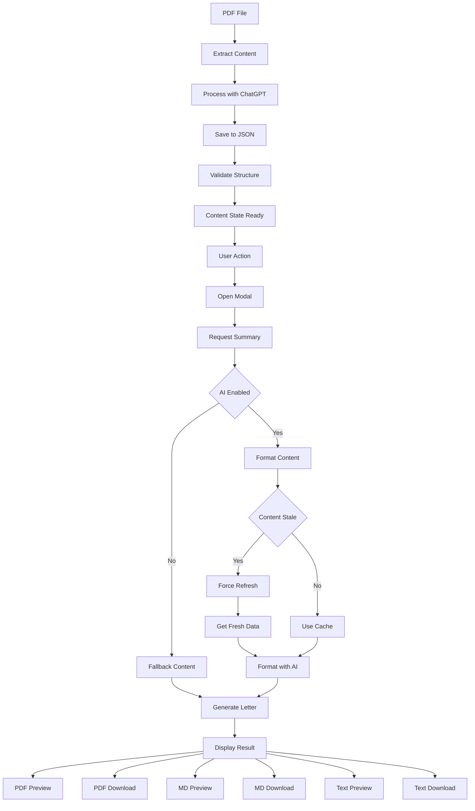

# Cover Letter Generation Process Analysis

## Process Flow Diagram

The following diagram illustrates the flow of data in the Cover Letter generation process, highlighting where cached data might be used instead of fresh PDF content.



## Key Components in the Process

1. **PDF Content Processing (Initial Phase)**
   - PDF extraction from `default_resume.pdf`
   - Text processing and analysis with ChatGPT
   - Storage of analyzed content in JSON format
   - Validation against Zod schemas
   - Establishment of a unified content state

2. **Cover Letter Generation (User-Triggered Phase)**
   - Triggered by user interaction after content is processed
   - API request to `/api/get-summary`
   - Content freshness check
   - Conditional refresh of stale content
   - Content formatting with OpenAI
   - Display in the SummaryModal component

3. **Download Operations (Final Phase)**
   - PDF preview and download
   - Markdown preview and download
   - Text preview and download

## Identified Issues

Based on the improved diagram and code review, here are the key issues causing the Cover Letter to use cached data instead of fresh PDF content:

### 1. Disconnected Process Flows

The current implementation treats PDF processing and Cover Letter generation as separate flows:
- PDF content is processed and stored during initial load or refresh
- Cover Letter generation happens independently when triggered by user action
- There's no guaranteed synchronization between these processes

### 2. Content Freshness Check Issues

The `checkContentFreshness()` function may not be correctly identifying when the PDF content has changed. This could be due to:

- Incorrect fingerprinting of PDF content
- Timestamp comparison issues
- Cache invalidation not being triggered properly

### 3. Caching at Multiple Layers

The application uses multiple caching mechanisms that aren't properly coordinated:

- File-based caching in `public/extracted/` directory
- In-memory caching in React components
- API response caching

If any of these layers isn't properly invalidated when the PDF changes, it could lead to stale data.

### 4. Inconsistent Force Refresh Parameter

Many API endpoints accept a `forceRefresh` parameter, but it's not consistently passed when needed:

```typescript
const forceRefresh = searchParams.get('forceRefresh') === 'true';
```

### 5. Missing Content State Management

There's no centralized content state management to ensure all components have access to the latest data:
- The PDF processing flow doesn't properly signal when new content is available
- The Cover Letter generation flow doesn't consistently check for the latest content

## Proposed Solutions

Based on our improved understanding of the process flow, here are the recommended solutions:

### 1. Unify the Process Flows

Create a unified content state that connects the PDF processing flow with the Cover Letter generation flow:

```typescript
// Create a centralized content state service
class ContentStateService {
  private static instance: ContentStateService;
  private contentState: {
    lastUpdated: Date;
    fingerprint: string;
    isProcessed: boolean;
    isAnalyzed: boolean;
  };

  // Implementation details...
}
```

### 2. Implement Robust Content Fingerprinting

Generate a unique hash for each PDF and use it consistently across all caching layers:

```typescript
// Generate a content fingerprint
function generateContentFingerprint(pdfBuffer: Buffer): string {
  const hash = crypto.createHash('sha256');
  hash.update(pdfBuffer);
  return hash.digest('hex');
}
```

### 3. Improve Content Freshness Checks

Enhance the `checkContentFreshness()` function to reliably detect changes:

```typescript
// Improved content freshness check
async function checkContentFreshness(): Promise<{isStale: boolean, reason?: string}> {
  // Get the current PDF fingerprint
  const currentFingerprint = await getCurrentPdfFingerprint();

  // Get the stored fingerprint from the content state
  const storedFingerprint = ContentStateService.getInstance().getFingerprint();

  // Compare fingerprints
  return {
    isStale: currentFingerprint !== storedFingerprint,
    reason: currentFingerprint !== storedFingerprint ?
      'PDF content has changed' : undefined
  };
}
```

### 4. Implement Consistent Force Refresh

Ensure the `forceRefresh` parameter is consistently passed when needed:

```typescript
// In the Cover Letter generation flow
async function generateCoverLetter() {
  // Always check freshness first
  const {isStale} = await checkContentFreshness();

  // Pass forceRefresh based on freshness check
  const response = await fetch(`/api/get-summary?forceRefresh=${isStale}`);
  // ...
}
```

### 5. Add Content State Signaling

Implement a signaling mechanism to notify components when content changes:

```typescript
// Content state change notification
ContentStateService.getInstance().onChange((newState) => {
  // Notify components that need to refresh
  notifyComponents(newState);
});
```

### 6. Add Manual Refresh Controls

Add UI controls to allow users to manually refresh content:

```tsx
// Add refresh button to SummaryModal
<button
  onClick={handleRefreshContent}
  disabled={isRefreshing}
  className="refresh-button"
>
  {isRefreshing ? 'Refreshing...' : 'Refresh Content'}
</button>
```

## Implementation Plan

To fix the issue with the Cover Letter using cached data, we should focus on these key areas:

1. **Create a ContentStateService** to manage the unified content state and provide change notifications.

2. **Update the PDF processing flow** to update the content state when new content is available.

3. **Modify the Cover Letter generation flow** to check the content state before generating content.

4. **Enhance the `checkContentFreshness()` function** to use robust fingerprinting.

5. **Add detailed logging** throughout the process to track content state changes.

6. **Update the SummaryModal component** to include a manual refresh button and display content freshness information.
