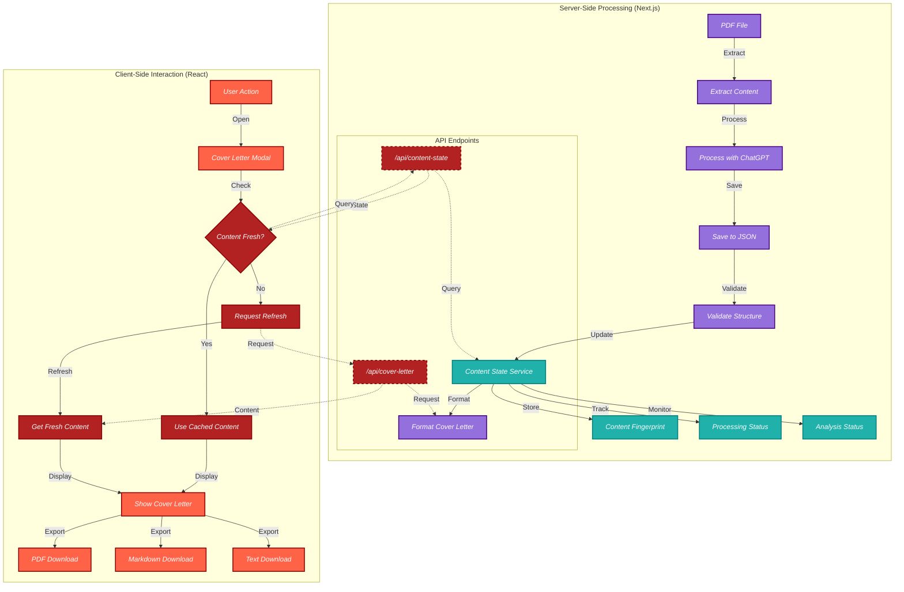

# Cover Letter Generation Process: A Philosophical Approach

This document explains the Cover Letter generation process through the lens of our philosophical approaches: Hesse's balance, Salinger's authenticity, Derrida's deconstruction, and Dante's framework.

## Process Flow Diagram

## Philosophical Approaches

### Hesse's Balance (Server-Side Processing)

Hermann Hesse's philosophy emphasizes balance, structure, and the search for meaning. In our application, the server-side processing embodies this approach:

- **PDF File Processing**: The extraction and analysis of PDF content follows a structured, methodical approach.
- **Content Validation**: We ensure the content meets our structural requirements, balancing flexibility with consistency.
- **Content Formatting**: The server formats the Cover Letter content, maintaining a balanced structure that reflects the user's essence.

The purple nodes in the diagram represent Hesse's influence, showing the structured, methodical approach to content processing.

### Salinger's Authenticity (Client-Side Interaction)

J.D. Salinger's work emphasizes authenticity and genuine human experience. Our client-side interactions embody this approach:

- **User Experience**: The interface is designed to be authentic and straightforward, focusing on the user's needs.
- **Content Presentation**: The Cover Letter is presented in a way that maintains the authentic voice of the user.
- **Download Options**: Multiple formats are provided to ensure the user can access their content in the most authentic way for their needs.

The orange nodes in the diagram represent Salinger's influence, showing the user-focused, authentic interactions.

### Derrida's Deconstruction (Content State Management)

Jacques Derrida's deconstruction philosophy breaks down structures to understand their components. Our content state management embodies this approach:

- **Content Fingerprinting**: We deconstruct the PDF content into a unique fingerprint that represents its essence.
- **State Tracking**: We break down the content processing into discrete states that can be tracked and monitored.
- **Centralized State Service**: We create a unified content state that connects all components, deconstructing traditional boundaries between processes.

The teal nodes in the diagram represent Derrida's influence, showing how we deconstruct content into manageable, trackable states.

### Dante's Framework (API and Content Freshness)

Dante Alighieri's "Divine Comedy" provides a framework for navigating different realms. Our API and content freshness check embody this approach:

- **API Endpoints**: Well-defined gateways between server and client realms, guiding the flow of content.
- **Freshness Evaluation**: We navigate through different "circles" of content freshness, determining if the content is stale or fresh.
- **Decision Points**: Clear decision points guide the flow of content, ensuring the user receives the most appropriate experience.

The red and purple-dashed nodes in the diagram represent Dante's influence, showing the framework that guides content through different realms.

## Implementation Details

The implementation follows these key principles:

1. **Unified Content State**: A centralized ContentStateService manages the state of PDF content throughout the application, following Derrida's principle of deconstructing content into its essential properties.

2. **Server-Side Processing**: All content processing and formatting happens on the server, following Hesse's principle of balance between structure and flexibility.

3. **API-Driven Communication**: Well-defined API endpoints serve as gateways between server and client realms, following Dante's framework for navigating different domains.

4. **Client-Side Authenticity**: The user interface focuses on authentic presentation and interaction, following Salinger's principle of genuine human experience.

5. **Content Freshness Management**: The application regularly checks if content is fresh or stale, ensuring users always have the latest data while providing transparency about content state.

### Key Components

1. **ContentStateService**: A singleton service that manages the state of PDF content, including fingerprinting, processing status, and analysis status.

2. **API Endpoints**:
   - `/api/content-state`: Provides information about the current content state
   - `/api/cover-letter`: Generates and returns formatted Cover Letter content

3. **SummaryModal Component**: A client-side component that displays the Cover Letter content and provides download options, with built-in content freshness checking.

4. **Content Freshness Indicator**: A visual indicator that shows when content is stale and provides a refresh button.

This implementation ensures that the Cover Letter generation process is robust, user-friendly, and philosophically grounded, with a clear separation of concerns between server and client components.
