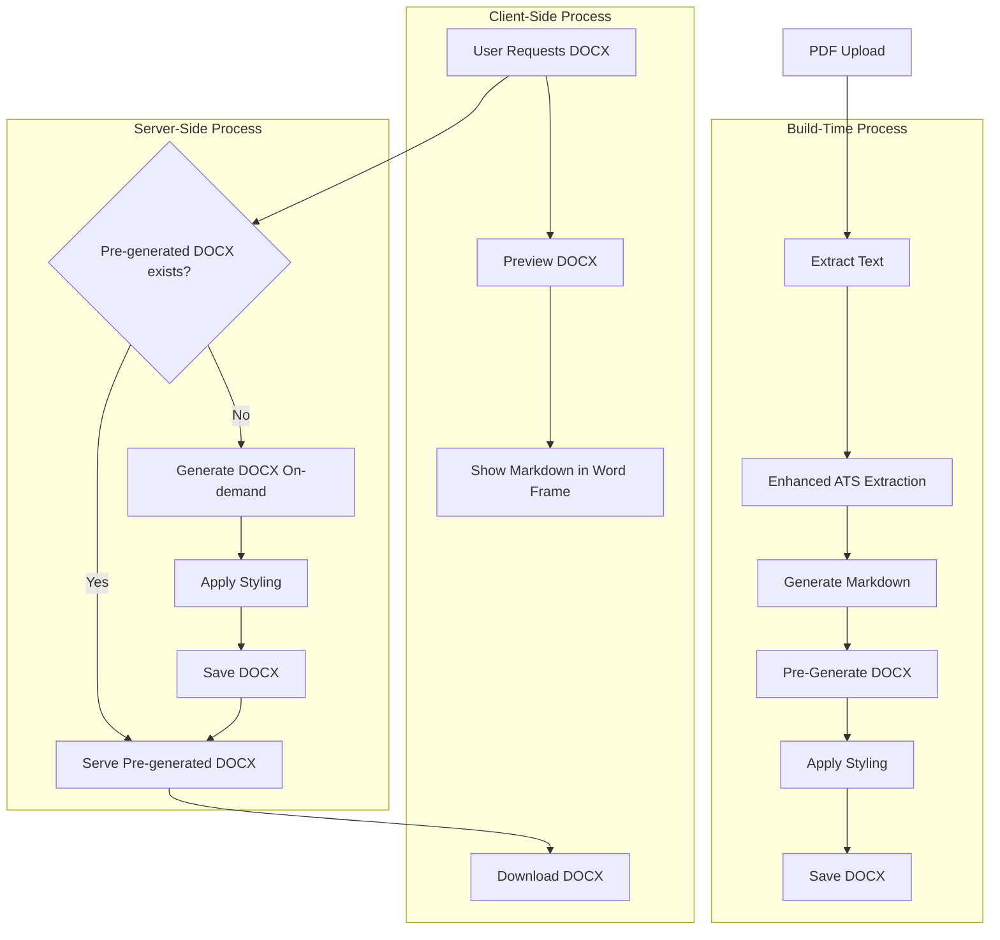

# DOCX Generation in AlexAI

This document describes the DOCX (Microsoft Word) generation feature in AlexAI, which allows users to generate and download Word documents from extracted PDF content.

## Overview

The DOCX generation feature extends AlexAI's existing PDF extraction capabilities to include Microsoft Word document generation. This allows users to download their resume content and introductions in DOCX format, which can be easily edited in Microsoft Word or other compatible applications.

The feature follows the same philosophical frameworks as the rest of AlexAI:

- **Salinger's Authentic Expression**: Intuitive user experience with a consistent visual language
- **Hesse's Mathematical Color Theory**: Mathematical approach to color theory and relationships
- **Derrida's Deconstruction**: Deconstructing hardcoded values with CSS variables and modular components
- **Dante's Methodical Organization**: Methodical logging and organization with emoji-based categorization
- **Kantian Ethics**: Professional business orientation with ethical considerations
- **Josef Müller-Brockmann's Grid Design**: Grid-based layouts, clear typography, and functional design

## Architecture

The DOCX generation feature consists of several components:

1. **Build-Time Components**:
   - `scripts/generate-docx-files.js`: Pre-generates DOCX files during the build phase
   - `scripts/prebuild-pdf-extraction.js`: Integrates DOCX generation into the build process
   - `templates/reference.docx`: Reference document template for pandoc

2. **Server-Side Components**:
   - `app/api/generate-docx/route.ts`: API endpoint for retrieving and generating DOCX files
   - GET endpoint: Retrieves pre-generated DOCX files
   - POST endpoint: Generates DOCX files on-demand from provided markdown content

3. **Client-Side Components**:
   - `components/SalingerHeader.tsx`: Updated to include DOCX preview and download for Resume
   - `components/SummaryModal.tsx`: Updated to include DOCX preview and download for Introduction
   - `components/PreviewModal.tsx`: Updated to support DOCX format with proper preview
   - `styles/PreviewModal.module.css`: Updated with styles for DOCX preview

## Enhanced ATS Extraction

The enhanced ATS extraction improves the accuracy of extracting user information from PDF resumes. It uses a combination of pattern matching and OpenAI analysis to extract structured data such as:

- Personal information (name, email, phone, etc.)
- Professional summary
- Skills (technical, soft, languages, tools, certifications)
- Experience (companies, job titles, dates, responsibilities, achievements)
- Education (institutions, degrees, fields of study, graduation years)
- ATS keywords for optimization

This information is used to generate more accurate and personalized DOCX documents.

## DOCX Generation Process

The DOCX generation process follows these steps:

1. **Extract Content**: Extract text content from the PDF using existing extraction tools
2. **Enhance with ATS**: Apply enhanced ATS extraction to get structured user information
3. **Generate Markdown**: Convert the extracted content to markdown format
4. **Pre-Generate DOCX**: Convert the markdown to DOCX format during the build phase using pandoc
5. **Apply Styling**: Apply styling based on extracted PDF fonts and colors using a reference document template
6. **Serve Pre-Generated Files**: Serve the pre-generated DOCX files via API endpoints
7. **Fallback Generation**: If pre-generated files are not available, generate DOCX on-demand

## Client-Side Implementation

The client-side implementation provides a seamless user experience for previewing and downloading DOCX files:

1. **Preview**:
   - Users can preview the DOCX content in the browser (currently shows markdown content with a Word document frame)
   - The preview is available in both the SalingerHeader (for Resume) and SummaryModal (for Introduction) components
   - The preview uses the PreviewModal component with format="docx" to display the content

2. **Download**:
   - Users can download the DOCX file directly from the browser
   - The download functionality first checks for pre-generated files via the GET API endpoint
   - If pre-generated files are not available, it falls back to on-demand generation via the POST API endpoint
   - The download uses proper MIME types and download attributes for better browser compatibility

3. **Styling**:
   - The DOCX file inherits styling from the extracted PDF fonts and colors
   - The styling is applied using a reference document template for pandoc
   - The preview maintains consistent styling with the rest of the application

## Server-Side Implementation

The server-side implementation handles the heavy lifting of DOCX generation:

1. **Build-Time Generation**: The `scripts/generate-docx-files.js` script pre-generates DOCX files during the build phase
2. **API Endpoints**:
   - GET `/api/generate-docx?fileName=resume|introduction`: Retrieves pre-generated DOCX files
   - POST `/api/generate-docx`: Generates DOCX files on-demand from provided markdown content
3. **File Storage**: The generated DOCX files are stored in the `public/extracted` directory
4. **File Naming**: Files are named based on the user's name extracted from the PDF (e.g., `benjamin_stein_resume.docx`)
5. **Fallback Mechanism**: If pandoc is not available, falls back to generating HTML files that can be opened in Word

## Usage

To use the DOCX generation feature:

1. Upload a PDF resume to AlexAI
2. Wait for the extraction process to complete
3. Click on the "Introduction" button to view the generated introduction
4. Click on the "Download" button to see download options
5. Select "Word Format" to download the introduction as a DOCX file

## Technical Details

### Pandoc

The DOCX generation uses pandoc, a powerful document converter, to convert markdown to DOCX. Pandoc provides several advantages:

- High-quality conversion from markdown to DOCX
- Support for reference document templates
- Consistent styling across different formats
- Proper handling of complex markdown features
- Wide platform support

The pandoc command used for conversion is:

```bash
pandoc "input.md" -o "output.docx" --reference-doc="templates/reference.docx"
```

Where:
- `input.md` is the markdown file to convert
- `output.docx` is the output DOCX file
- `templates/reference.docx` is the reference document template for styling

### Styling

The DOCX styling is based on the extracted PDF fonts and colors, following the Hesse philosophy of mathematical color theory. The styling is applied using a reference document template for pandoc, which includes:

- Heading fonts and sizes (h1, h2, h3)
- Body text fonts and sizes
- Primary and secondary colors
- Text colors and background colors
- Paragraph spacing and indentation
- List formatting (bullet points, numbered lists)
- Table styling

The reference document template (`templates/reference.docx`) is a simple Word document that defines the styles used for the conversion. Pandoc uses this template to apply consistent styling to the generated DOCX files.

### Error Handling and Fallbacks

The DOCX generation includes comprehensive error handling following the Dante philosophy of methodical organization:

- **Server-Side Error Handling**:
  - Detailed logging with appropriate emojis using the DanteLogger
  - Structured error responses with clear error messages
  - Fallback to HTML generation if pandoc fails
  - Verification of generated files to ensure they are valid

- **Client-Side Error Handling**:
  - Graceful handling of API errors with user-friendly messages
  - Fallback to on-demand generation if pre-generated files are not available
  - Loading indicators during generation and download
  - Proper cleanup of temporary files and resources

- **HTML Fallback Mechanism**:
  - If pandoc is not available or fails, the system falls back to generating an HTML file
  - The HTML file is styled to be compatible with Microsoft Word
  - The HTML file includes proper Word-specific XML namespaces and metadata
  - The HTML file can be opened in Word and saved as a DOCX file

## Future Enhancements

Potential future enhancements to the DOCX generation feature include:

1. **Enhanced DOCX Styling**:
   - Create a more sophisticated reference.docx template with proper styling
   - Apply PDF-extracted colors and fonts to the DOCX template
   - Ensure consistent header, paragraph, and list styling

2. **True DOCX Preview**:
   - Implement a true DOCX preview in the browser using a library like mammoth.js
   - Show a more accurate representation of the DOCX file in the preview
   - Add a loading indicator during preview generation

3. **Error Handling and Fallbacks**:
   - Improve error messages and user feedback
   - Add more robust fallback mechanisms for environments without pandoc
   - Implement retry logic for failed DOCX generation

4. **Template System**:
   - Create multiple DOCX templates for different purposes (resume, cover letter, etc.)
   - Allow users to select different templates for their documents
   - Implement a template preview feature

5. **Custom Styling Options**:
   - Allow users to customize the styling of their DOCX files
   - Implement a style editor for fonts, colors, margins, etc.
   - Save user preferences for future use

6. **Integration with Other Services**:
   - Add support for uploading DOCX files directly to cloud storage (Google Drive, OneDrive, etc.)
   - Implement email sharing functionality for DOCX files
   - Add integration with job application platforms

## Conclusion

The DOCX generation feature enhances AlexAI's capabilities by providing users with another format for downloading their resume content and introductions. It follows the same philosophical frameworks as the rest of AlexAI, ensuring a consistent and intuitive user experience.

## Diagram


