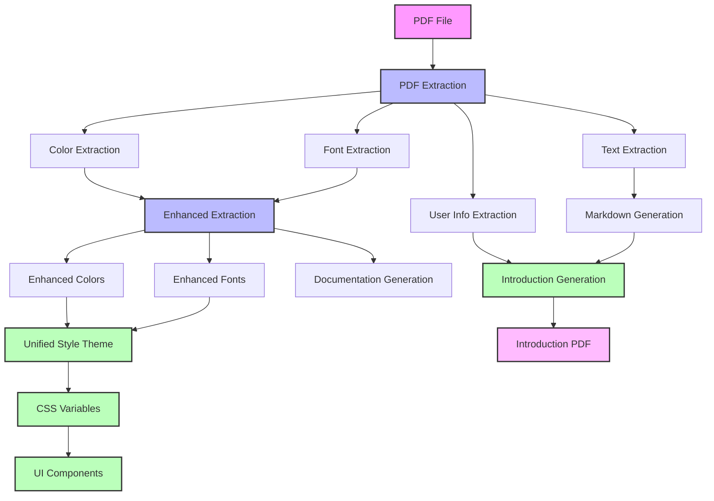
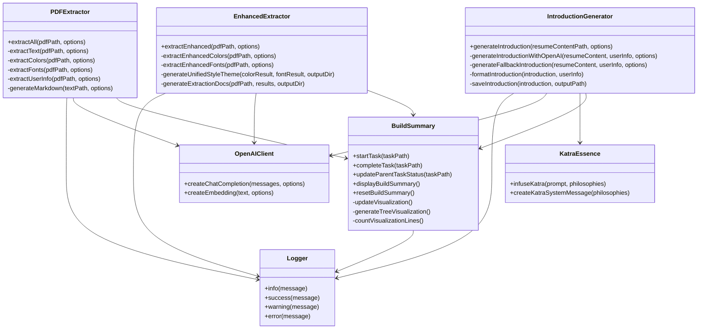
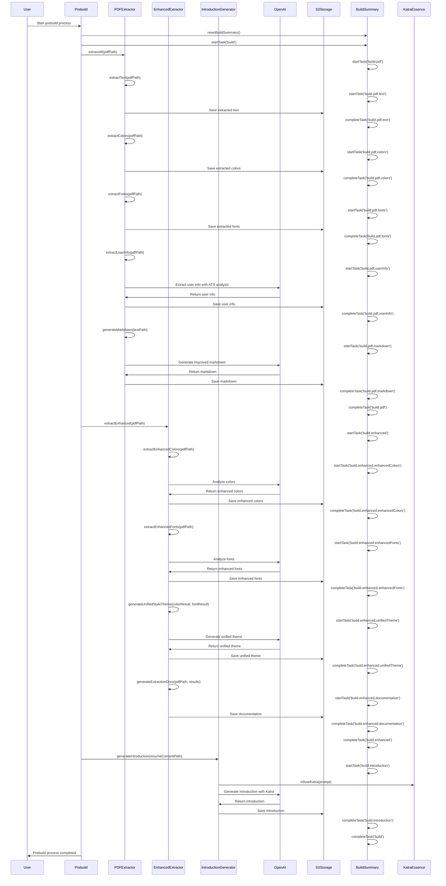
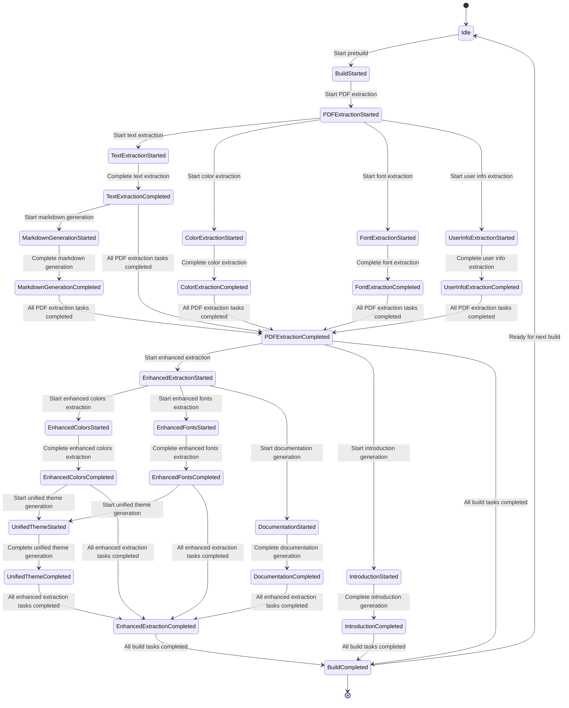

# PDF Extraction Flow

## Process Flow Diagram

```mermaid
flowchart TD
    A[PDF File] --> B[PDF Extraction]
    B --> C[Text Extraction]
    B --> D[Color Extraction]
    B --> E[Font Extraction]
    B --> F[User Info Extraction]
    
    C --> G[Markdown Generation]
    
    D --> H[Enhanced Extraction]
    E --> H
    
    H --> I[Enhanced Colors]
    H --> J[Enhanced Fonts]
    I --> K[Unified Style Theme]
    J --> K
    H --> L[Documentation Generation]
    
    F --> M[Introduction Generation]
    G --> M
    
    K --> N[CSS Variables]
    N --> O[UI Components]
    
    M --> P[Introduction PDF]
    
    style A fill:#f9f,stroke:#333,stroke-width:2px
    style B fill:#bbf,stroke:#333,stroke-width:2px
    style H fill:#bbf,stroke:#333,stroke-width:2px
    style K fill:#bfb,stroke:#333,stroke-width:2px
    style M fill:#bfb,stroke:#333,stroke-width:2px
    style N fill:#bfb,stroke:#333,stroke-width:2px
    style O fill:#bfb,stroke:#333,stroke-width:2px
    style P fill:#fbf,stroke:#333,stroke-width:2px
```

## Component Diagram

```mermaid
classDiagram
    class PDFExtractor {
        +extractAll(pdfPath, options)
        -extractText(pdfPath, options)
        -extractColors(pdfPath, options)
        -extractFonts(pdfPath, options)
        -extractUserInfo(pdfPath, options)
        -generateMarkdown(textPath, options)
    }
    
    class EnhancedExtractor {
        +extractEnhanced(pdfPath, options)
        -extractEnhancedColors(pdfPath, options)
        -extractEnhancedFonts(pdfPath, options)
        -generateUnifiedStyleTheme(colorResult, fontResult, outputDir)
        -generateExtractionDocs(pdfPath, results, outputDir)
    }
    
    class IntroductionGenerator {
        +generateIntroduction(resumeContentPath, options)
        -generateIntroductionWithOpenAI(resumeContent, userInfo, options)
        -generateFallbackIntroduction(resumeContent, userInfo, options)
        -formatIntroduction(introduction, userInfo)
        -saveIntroduction(introduction, outputPath)
    }
    
    class BuildSummary {
        +startTask(taskPath)
        +completeTask(taskPath)
        +updateParentTaskStatus(taskPath)
        +displayBuildSummary()
        +resetBuildSummary()
        -updateVisualization()
        -generateTreeVisualization()
        -countVisualizationLines()
    }
    
    class Logger {
        +info(message)
        +success(message)
        +warning(message)
        +error(message)
    }
    
    class OpenAIClient {
        +createChatCompletion(messages, options)
        +createEmbedding(text, options)
    }
    
    class KatraEssence {
        +infuseKatra(prompt, philosophies)
        +createKatraSystemMessage(philosophies)
    }
    
    PDFExtractor --> Logger
    PDFExtractor --> OpenAIClient
    PDFExtractor --> BuildSummary
    
    EnhancedExtractor --> Logger
    EnhancedExtractor --> OpenAIClient
    EnhancedExtractor --> BuildSummary
    
    IntroductionGenerator --> Logger
    IntroductionGenerator --> OpenAIClient
    IntroductionGenerator --> KatraEssence
    IntroductionGenerator --> BuildSummary
    
    BuildSummary --> Logger
```

## Sequence Diagram

```mermaid
sequenceDiagram
    participant User
    participant Prebuild
    participant PDFExtractor
    participant EnhancedExtractor
    participant IntroductionGenerator
    participant OpenAI
    participant S3Storage
    
    User->>Prebuild: Start prebuild process
    Prebuild->>BuildSummary: resetBuildSummary()
    Prebuild->>BuildSummary: startTask('build')
    
    Prebuild->>PDFExtractor: extractAll(pdfPath)
    BuildSummary->>BuildSummary: startTask('build.pdf')
    
    PDFExtractor->>PDFExtractor: extractText(pdfPath)
    BuildSummary->>BuildSummary: startTask('build.pdf.text')
    PDFExtractor->>S3Storage: Save extracted text
    BuildSummary->>BuildSummary: completeTask('build.pdf.text')
    
    PDFExtractor->>PDFExtractor: extractColors(pdfPath)
    BuildSummary->>BuildSummary: startTask('build.pdf.colors')
    PDFExtractor->>S3Storage: Save extracted colors
    BuildSummary->>BuildSummary: completeTask('build.pdf.colors')
    
    PDFExtractor->>PDFExtractor: extractFonts(pdfPath)
    BuildSummary->>BuildSummary: startTask('build.pdf.fonts')
    PDFExtractor->>S3Storage: Save extracted fonts
    BuildSummary->>BuildSummary: completeTask('build.pdf.fonts')
    
    PDFExtractor->>PDFExtractor: extractUserInfo(pdfPath)
    BuildSummary->>BuildSummary: startTask('build.pdf.userInfo')
    PDFExtractor->>OpenAI: Extract user info with ATS analysis
    OpenAI->>PDFExtractor: Return user info
    PDFExtractor->>S3Storage: Save user info
    BuildSummary->>BuildSummary: completeTask('build.pdf.userInfo')
    
    PDFExtractor->>PDFExtractor: generateMarkdown(textPath)
    BuildSummary->>BuildSummary: startTask('build.pdf.markdown')
    PDFExtractor->>OpenAI: Generate improved markdown
    OpenAI->>PDFExtractor: Return markdown
    PDFExtractor->>S3Storage: Save markdown
    BuildSummary->>BuildSummary: completeTask('build.pdf.markdown')
    
    BuildSummary->>BuildSummary: completeTask('build.pdf')
    
    Prebuild->>EnhancedExtractor: extractEnhanced(pdfPath)
    BuildSummary->>BuildSummary: startTask('build.enhanced')
    
    EnhancedExtractor->>EnhancedExtractor: extractEnhancedColors(pdfPath)
    BuildSummary->>BuildSummary: startTask('build.enhanced.enhancedColors')
    EnhancedExtractor->>OpenAI: Analyze colors
    OpenAI->>EnhancedExtractor: Return enhanced colors
    EnhancedExtractor->>S3Storage: Save enhanced colors
    BuildSummary->>BuildSummary: completeTask('build.enhanced.enhancedColors')
    
    EnhancedExtractor->>EnhancedExtractor: extractEnhancedFonts(pdfPath)
    BuildSummary->>BuildSummary: startTask('build.enhanced.enhancedFonts')
    EnhancedExtractor->>OpenAI: Analyze fonts
    OpenAI->>EnhancedExtractor: Return enhanced fonts
    EnhancedExtractor->>S3Storage: Save enhanced fonts
    BuildSummary->>BuildSummary: completeTask('build.enhanced.enhancedFonts')
    
    EnhancedExtractor->>EnhancedExtractor: generateUnifiedStyleTheme(colorResult, fontResult)
    BuildSummary->>BuildSummary: startTask('build.enhanced.unifiedTheme')
    EnhancedExtractor->>OpenAI: Generate unified theme
    OpenAI->>EnhancedExtractor: Return unified theme
    EnhancedExtractor->>S3Storage: Save unified theme
    BuildSummary->>BuildSummary: completeTask('build.enhanced.unifiedTheme')
    
    EnhancedExtractor->>EnhancedExtractor: generateExtractionDocs(pdfPath, results)
    BuildSummary->>BuildSummary: startTask('build.enhanced.documentation')
    EnhancedExtractor->>S3Storage: Save documentation
    BuildSummary->>BuildSummary: completeTask('build.enhanced.documentation')
    
    BuildSummary->>BuildSummary: completeTask('build.enhanced')
    
    Prebuild->>IntroductionGenerator: generateIntroduction(resumeContentPath)
    BuildSummary->>BuildSummary: startTask('build.introduction')
    
    IntroductionGenerator->>KatraEssence: infuseKatra(prompt)
    IntroductionGenerator->>OpenAI: Generate introduction with Katra
    OpenAI->>IntroductionGenerator: Return introduction
    IntroductionGenerator->>S3Storage: Save introduction
    BuildSummary->>BuildSummary: completeTask('build.introduction')
    
    BuildSummary->>BuildSummary: completeTask('build')
    
    Prebuild->>User: Prebuild process completed
```

## State Diagram

```mermaid
stateDiagram-v2
    [*] --> Idle
    
    Idle --> BuildStarted: Start prebuild
    
    BuildStarted --> PDFExtractionStarted: Start PDF extraction
    PDFExtractionStarted --> TextExtractionStarted: Start text extraction
    TextExtractionStarted --> TextExtractionCompleted: Complete text extraction
    
    PDFExtractionStarted --> ColorExtractionStarted: Start color extraction
    ColorExtractionStarted --> ColorExtractionCompleted: Complete color extraction
    
    PDFExtractionStarted --> FontExtractionStarted: Start font extraction
    FontExtractionStarted --> FontExtractionCompleted: Complete font extraction
    
    PDFExtractionStarted --> UserInfoExtractionStarted: Start user info extraction
    UserInfoExtractionStarted --> UserInfoExtractionCompleted: Complete user info extraction
    
    TextExtractionCompleted --> MarkdownGenerationStarted: Start markdown generation
    MarkdownGenerationStarted --> MarkdownGenerationCompleted: Complete markdown generation
    
    TextExtractionCompleted --> PDFExtractionCompleted: All PDF extraction tasks completed
    ColorExtractionCompleted --> PDFExtractionCompleted: All PDF extraction tasks completed
    FontExtractionCompleted --> PDFExtractionCompleted: All PDF extraction tasks completed
    UserInfoExtractionCompleted --> PDFExtractionCompleted: All PDF extraction tasks completed
    MarkdownGenerationCompleted --> PDFExtractionCompleted: All PDF extraction tasks completed
    
    PDFExtractionCompleted --> EnhancedExtractionStarted: Start enhanced extraction
    
    EnhancedExtractionStarted --> EnhancedColorsStarted: Start enhanced colors extraction
    EnhancedColorsStarted --> EnhancedColorsCompleted: Complete enhanced colors extraction
    
    EnhancedExtractionStarted --> EnhancedFontsStarted: Start enhanced fonts extraction
    EnhancedFontsStarted --> EnhancedFontsCompleted: Complete enhanced fonts extraction
    
    EnhancedColorsCompleted --> UnifiedThemeStarted: Start unified theme generation
    EnhancedFontsCompleted --> UnifiedThemeStarted: Start unified theme generation
    UnifiedThemeStarted --> UnifiedThemeCompleted: Complete unified theme generation
    
    EnhancedExtractionStarted --> DocumentationStarted: Start documentation generation
    DocumentationStarted --> DocumentationCompleted: Complete documentation generation
    
    EnhancedColorsCompleted --> EnhancedExtractionCompleted: All enhanced extraction tasks completed
    EnhancedFontsCompleted --> EnhancedExtractionCompleted: All enhanced extraction tasks completed
    UnifiedThemeCompleted --> EnhancedExtractionCompleted: All enhanced extraction tasks completed
    DocumentationCompleted --> EnhancedExtractionCompleted: All enhanced extraction tasks completed
    
    PDFExtractionCompleted --> IntroductionStarted: Start introduction generation
    IntroductionStarted --> IntroductionCompleted: Complete introduction generation
    
    PDFExtractionCompleted --> BuildCompleted: All build tasks completed
    EnhancedExtractionCompleted --> BuildCompleted: All build tasks completed
    IntroductionCompleted --> BuildCompleted: All build tasks completed
    
    BuildCompleted --> Idle: Ready for next build
    
    BuildCompleted --> [*]
```
