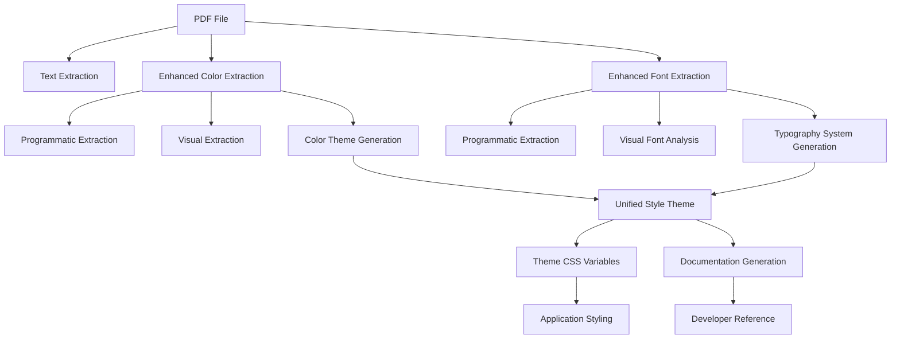

# Enhanced PDF Style Extraction

This document explains the enhanced PDF style extraction system implemented in AlexAI. The system extracts a comprehensive style theme from PDF files, including colors, fonts, and other design elements.

## Overview

The enhanced extraction system uses multiple approaches to extract style information from PDFs:

1. **Programmatic Extraction**: Analyzes the PDF structure to extract explicit style information
2. **Visual Analysis**: Renders PDF pages and analyzes the visual appearance
3. **AI Enhancement**: Uses OpenAI to analyze and enhance the extracted styles
4. **Style Inference**: Infers a complete style system from partial information

## Extraction Process

The extraction process follows these steps:

1. **Text Extraction**: Extract text content from the PDF
2. **Color Extraction**: Extract colors using enhanced methods
3. **Font Extraction**: Extract fonts using enhanced methods
4. **Style Theme Generation**: Generate a unified style theme
5. **Documentation Generation**: Generate documentation of the extraction results

## Output Files

The enhanced extraction process generates the following files:

### Standard Extraction Files

- `resume_content.txt`: Raw text content
- `resume_content.md`: Basic markdown conversion
- `resume_content_improved.md`: OpenAI-enhanced markdown
- `color_theory.json`: Basic color theory information
- `font_theory.json`: Basic font theory information
- `pdf_fonts.css`: CSS with font variables

### Enhanced Extraction Files

- `enhanced_color_theory.json`: Enhanced color theory information
- `enhanced_font_theory.json`: Enhanced font theory information
- `enhanced_pdf_fonts.css`: Enhanced CSS with font variables
- `unified_style_theme.json`: Unified style theme combining colors and fonts
- `unified_theme.css`: CSS variables for the unified style theme
- `extraction_documentation.md`: Documentation of the extraction process

## Enhanced Color Extraction

The enhanced color extraction process extracts colors from PDFs using multiple methods:

### Programmatic Extraction

- Analyzes PDF content streams for color definitions
- Extracts RGB, CMYK, and hex color values
- Categorizes colors as text, background, or accent

### Visual Extraction (Future Implementation)

- Renders PDF pages as images
- Uses color quantization to extract dominant colors
- Analyzes color relationships and usage patterns

### Color Theme Generation

- Analyzes color relationships to create a cohesive theme
- Generates primary, secondary, accent, and other color roles
- Validates colors for contrast and accessibility

## Enhanced Font Extraction

The enhanced font extraction process extracts fonts from PDFs using multiple methods:

### Programmatic Extraction

- Analyzes PDF font objects and their usage
- Extracts font names, types, and properties
- Categorizes fonts based on their characteristics

### Visual Font Analysis (Future Implementation)

- Analyzes rendered text to identify fonts
- Uses font detection algorithms to match fonts
- Analyzes typographic patterns and hierarchy

### Typography System Generation

- Creates a cohesive typography system
- Assigns fonts to different roles (heading, body, etc.)
- Generates appropriate font pairings and fallbacks

## Unified Style Theme

The unified style theme combines colors and fonts into a comprehensive design system:

### Theme Structure

```json
{
  "name": "PDF-Extracted Theme",
  "version": "1.0.0",
  "description": "A unified style theme extracted from PDF",
  "colors": {
    "primary": "#3366CC",
    "secondary": "#004e98",
    "accent": "#ff6700",
    "background": "#FFFFFF",
    "text": "#000000",
    "textSecondary": "#666666",
    "border": "#dddddd",
    "success": "#28a745",
    "warning": "#ffc107",
    "error": "#dc3545",
    "info": "#17a2b8"
  },
  "typography": {
    "heading": "Arial, Helvetica, sans-serif",
    "body": "Georgia, Times New Roman, serif",
    "mono": "Courier New, monospace",
    "title": "Arial, Helvetica, sans-serif",
    "subtitle": "Georgia, Times New Roman, serif",
    "button": "Arial, Helvetica, sans-serif",
    "nav": "Arial, Helvetica, sans-serif",
    "code": "Courier New, monospace"
  },
  "spacing": {
    "unit": "rem",
    "scale": [0, 0.25, 0.5, 1, 1.5, 2, 3, 4, 6, 8]
  },
  "breakpoints": {
    "sm": "640px",
    "md": "768px",
    "lg": "1024px",
    "xl": "1280px"
  },
  "components": {
    "button": {
      "borderRadius": "0.25rem",
      "fontFamily": "var(--pdf-button-font)",
      "backgroundColor": "var(--pdf-primary-color)",
      "textColor": "var(--pdf-background-color)"
    },
    "card": {
      "borderRadius": "0.5rem",
      "backgroundColor": "var(--pdf-background-color)",
      "borderColor": "var(--pdf-border-color)"
    },
    "input": {
      "borderRadius": "0.25rem",
      "borderColor": "var(--pdf-border-color)",
      "backgroundColor": "var(--pdf-background-color)"
    }
  }
}
```

### CSS Variables

The unified theme is converted to CSS variables:

```css
:root {
  /* Color variables */
  --theme-color-primary: #3366CC;
  --theme-color-secondary: #004e98;
  --theme-color-accent: #ff6700;
  --theme-color-background: #FFFFFF;
  --theme-color-text: #000000;
  
  /* Typography variables */
  --theme-font-heading: Arial, Helvetica, sans-serif;
  --theme-font-body: Georgia, "Times New Roman", serif;
  --theme-font-mono: "Courier New", monospace;
  
  /* Component variables */
  --theme-component-button-borderRadius: 0.25rem;
  --theme-component-button-fontFamily: var(--pdf-button-font);
  --theme-component-button-backgroundColor: var(--pdf-primary-color);
  --theme-component-button-textColor: var(--pdf-background-color);
}
```

## Extraction Documentation

The extraction process generates documentation that includes:

- Source PDF information
- Extraction results for text, colors, and fonts
- Color palette with swatches
- Font system with samples
- Unified style theme description
- Component style examples

## Usage in the Application

To use the enhanced extraction in your application:

### 1. Import the CSS

```html
<link rel="stylesheet" href="/extracted/unified_theme.css">
```

### 2. Apply the Theme Variables

```css
.button {
  background-color: var(--theme-color-primary);
  color: var(--theme-color-background);
  font-family: var(--theme-font-button);
  border-radius: var(--theme-component-button-borderRadius);
}
```

### 3. Use the Utility Classes

```html
<h1 class="theme-heading">Heading Text</h1>
<p class="theme-body">Body text</p>
<button class="theme-button">Click Me</button>
```

## Philosophical Framework Integration

The enhanced extraction system integrates with AlexAI's philosophical frameworks:

### Hesse

- Mathematical precision in color theory
- Harmonious organization of typography
- Systematic approach to design elements

### Salinger

- Intuitive visual language
- Consistent application of styles
- Transparent, approachable design system

### Derrida

- Deconstruction of hardcoded values
- Configurable design system
- Adaptable to different contexts

### Dante

- Methodical logging and organization
- Clear categorization of design elements
- Comprehensive documentation

## Future Enhancements

Planned enhancements to the extraction system:

1. **Visual Color Extraction**: Implement color extraction from rendered PDF pages
2. **Visual Font Analysis**: Implement font detection from rendered text
3. **Layout Analysis**: Extract spacing, margins, and layout information
4. **Component Pattern Recognition**: Identify design patterns and component styles
5. **Accessibility Validation**: Validate extracted styles for accessibility compliance

## Conclusion

The enhanced PDF style extraction system provides a comprehensive approach to extracting and applying styles from PDF files. By combining programmatic extraction, visual analysis, and AI enhancement, it creates a cohesive design system that can be applied throughout the application.

## Mermaid Diagram


