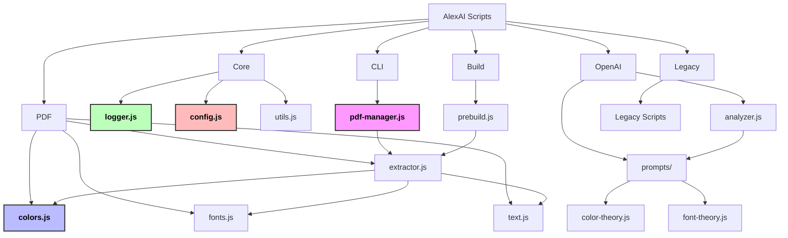

# AlexAI Script Structure

This document describes the structure and organization of the scripts in the AlexAI project.

## Overview Diagram

> **Note**: To view this diagram in higher resolution or export it as SVG/PDF:
> 1. Open the file `docs/diagrams/viewer.html` in your browser for the Interactive Documentation Viewer
> 2. Or manually copy the Mermaid code below and visit the [Mermaid Live Editor](https://mermaid.live/)
> 3. Pre-rendered versions are available in the `docs/diagrams/` directory
>
> **VSCode Users**: Right-click on `docs/diagrams/viewer.html` and select "Open with Live Server" if you have the Live Server extension installed.



## Philosophy

The script structure follows four philosophical frameworks:

1. **Salinger**: Intuitive organization with a consistent structure that makes the codebase easier to navigate.
2. **Hesse**: Mathematical organization with a logical, harmonious structure.
3. **Derrida**: Deconstruction of hardcoded values, replacing them with configurable options.
4. **Dante**: Methodical logging and documentation throughout the codebase.

## Directory Structure

```
scripts/
├── core/                  # Core functionality
│   ├── logger.js          # Unified logging system (Dante)
│   ├── config.js          # Configuration management (Derrida)
│   └── utils.js           # Common utilities
├── pdf/                   # PDF processing
│   ├── extractor.js       # Unified PDF extraction
│   ├── colors.js          # Color extraction and processing (Hesse)
│   ├── fonts.js           # Font extraction and processing
│   └── text.js            # Text extraction and processing
├── openai/                # OpenAI integration
│   ├── analyzer.js        # OpenAI analysis functions
│   └── prompts/           # Prompts directory
│       ├── color-theory.js
│       └── font-theory.js
├── build/                 # Build process scripts
│   └── prebuild.js        # Prebuild processing
├── cli/                   # Command-line tools
│   └── pdf-manager.js     # PDF management CLI
└── legacy/                # Legacy scripts (for reference only)
    └── README.md          # Documentation for legacy scripts
```

## Core Modules

### Logger (scripts/core/logger.js)

The logger module provides a unified logging system following the Dante philosophy of methodical logging with clear categorization and visual indicators.

```javascript
const logger = createLogger('category');
logger.info('This is an info message');
logger.success('This is a success message');
logger.warning('This is a warning message');
logger.error('This is an error message');
logger.debug('This is a debug message');
```

### Config (scripts/core/config.js)

The config module provides a centralized configuration system following the Derrida philosophy of deconstructing hardcoded values and replacing them with configurable options.

```javascript
const config = require('../core/config');
const defaultPdfPath = config.pdf.defaultPdf;
const outputDir = config.paths.extracted;
```

### Utils (scripts/core/utils.js)

The utils module provides common utility functions used across the application.

```javascript
const utils = require('../core/utils');
utils.ensureDir(outputDir);
utils.saveJson(outputPath, data);
utils.loadJson(inputPath);
utils.saveText(outputPath, text);
utils.loadText(inputPath);
```

## PDF Processing Modules

### Extractor (scripts/pdf/extractor.js)

The extractor module provides a unified interface for extracting information from PDF files.

```javascript
const { extractAll } = require('../pdf/extractor');
const result = await extractAll('path/to/pdf.pdf');
```

### Colors (scripts/pdf/colors.js)

The colors module extracts colors from PDF files and applies Hesse color theory to create a harmonious color palette.

```javascript
const { extractColors } = require('../pdf/colors');
const result = await extractColors('path/to/pdf.pdf');
```

### Fonts (scripts/pdf/fonts.js)

The fonts module extracts fonts from PDF files and creates a typography system.

```javascript
const { extractFonts } = require('../pdf/fonts');
const result = await extractFonts('path/to/pdf.pdf');
```

### Text (scripts/pdf/text.js)

The text module extracts text content from PDF files.

```javascript
const { extractText, generateImprovedMarkdown } = require('../pdf/text');
const result = await extractText('path/to/pdf.pdf');
const markdown = await generateImprovedMarkdown('path/to/text.txt');
```

## OpenAI Integration

### Analyzer (scripts/openai/analyzer.js)

The analyzer module provides functions for analyzing PDF content using OpenAI.

```javascript
const { analyzeColorsWithOpenAI, analyzeFontsWithOpenAI, analyzeTextWithOpenAI } = require('../openai/analyzer');
const colorTheory = await analyzeColorsWithOpenAI('path/to/pdf.pdf', colors);
const fontTheory = await analyzeFontsWithOpenAI('path/to/pdf.pdf', fontFamilies, fontInfo);
const markdown = await analyzeTextWithOpenAI(text);
```

## Build Process

### Prebuild (scripts/build/prebuild.js)

The prebuild module runs before the build process to ensure that PDF extraction is completed before any UI components are rendered.

```javascript
node scripts/build/prebuild.js
```

## Command-Line Tools

### PDF Manager (scripts/cli/pdf-manager.js)

The PDF manager module provides a command-line interface for managing PDFs in the AlexAI application.

```bash
# List available PDFs
node scripts/cli/pdf-manager.js list

# Extract information from a PDF
node scripts/cli/pdf-manager.js extract <pdf-path>

# Set a PDF as the default
node scripts/cli/pdf-manager.js set-default <pdf-path>
```

## Configuration File

The configuration file (`alexai.config.js`) contains configuration settings for the AlexAI application. It follows the Derrida philosophy of deconstructing hardcoded values and replacing them with configurable options.

```javascript
module.exports = {
  paths: {
    public: 'public',
    extracted: 'public/extracted',
    sourcePdfs: 'source-pdfs',
    backup: 'public/backup',
    scripts: 'scripts',
    uploads: 'public/uploads',
    testPdfs: 'public/test-pdfs'
  },
  pdf: {
    defaultPdf: 'public/pbradygeorgen_resume.pdf',
    backupPrefix: 'pbradygeorgen_resume_',
    extractionTimeout: 60000,
    defaultFallbacks: {
      fontHeading: 'Arial, Helvetica, sans-serif',
      fontBody: 'Georgia, "Times New Roman", serif',
      fontMono: '"Courier New", monospace',
      colorPrimary: '#3366CC',
      colorBackground: '#FFFFFF',
      colorText: '#000000'
    }
  },
  // ... more configuration options
};
```

## NPM Scripts

The following NPM scripts are available for working with PDFs:

```bash
# Run the prebuild process
npm run prebuild

# List available PDFs
npm run pdf:list

# Extract information from a PDF
npm run pdf:extract <pdf-path>

# Extract information from the default PDF
npm run pdf:extract:default

# Set a PDF as the default
npm run pdf:set-default <pdf-path>

# Run the PDF Manager CLI with a command
npm run pdf <command>
```

## Process Flow

The following diagram shows the process flow for PDF extraction and processing:

> **Note**: To view this diagram in higher resolution or export it as SVG/PDF:
> 1. Open the file `docs/diagrams/viewer.html` in your browser for the Interactive Documentation Viewer
> 2. Or manually copy the Mermaid code below and visit the [Mermaid Live Editor](https://mermaid.live/)
> 3. Pre-rendered versions are available in the `docs/diagrams/` directory
>
> **VSCode Users**: Right-click on `docs/diagrams/viewer.html` and select "Open with Live Server" if you have the Live Server extension installed.

```mermaid
sequenceDiagram
    %% Improved styling for better contrast
    participant User
    participant CLI as PDF Manager CLI
    participant Extractor as PDF Extractor
    participant Text as Text Extractor
    participant Colors as Color Extractor
    participant Fonts as Font Extractor
    participant OpenAI as OpenAI Analyzer
    participant Files as File System

    %% Apply styling to participants
    style User fill:#f9f,stroke:#333,stroke-width:2px,color:#000,font-weight:bold
    style CLI fill:#bbf,stroke:#333,stroke-width:2px,color:#000,font-weight:bold
    style Extractor fill:#bbf,stroke:#333,stroke-width:2px,color:#000,font-weight:bold
    style Text fill:#fbb,stroke:#333,stroke-width:2px,color:#000,font-weight:bold
    style Colors fill:#fbb,stroke:#333,stroke-width:2px,color:#000,font-weight:bold
    style Fonts fill:#fbb,stroke:#333,stroke-width:2px,color:#000,font-weight:bold
    style OpenAI fill:#bfb,stroke:#333,stroke-width:2px,color:#000,font-weight:bold
    style Files fill:#fbf,stroke:#333,stroke-width:2px,color:#000,font-weight:bold

    User->>CLI: npm run pdf:extract <pdf-path>
    CLI->>Extractor: extractAll(pdfPath)
    Extractor->>Files: Check if PDF exists
    Files-->>Extractor: PDF exists
    Extractor->>Files: Create output directory

    par Text Extraction
        Extractor->>Text: extractText(pdfPath)
        Text->>Files: Read PDF
        Files-->>Text: PDF content
        Text->>Files: Save extracted text
        Files-->>Text: Text saved
        Text-->>Extractor: Text extraction result
    and Color Extraction
        Extractor->>Colors: extractColors(pdfPath)
        Colors->>Files: Read PDF
        Files-->>Colors: PDF content
        Colors->>OpenAI: analyzeColorsWithOpenAI (if API key available)
        OpenAI-->>Colors: Color theory
        Colors->>Files: Save color theory
        Files-->>Colors: Color theory saved
        Colors-->>Extractor: Color extraction result
    and Font Extraction
        Extractor->>Fonts: extractFonts(pdfPath)
        Fonts->>Files: Read PDF
        Files-->>Fonts: PDF content
        Fonts->>OpenAI: analyzeFontsWithOpenAI (if API key available)
        OpenAI-->>Fonts: Font theory
        Fonts->>Files: Save font theory and CSS
        Files-->>Fonts: Font files saved
        Fonts-->>Extractor: Font extraction result
    end

    opt Generate Improved Markdown
        Extractor->>Text: generateImprovedMarkdown(textPath)
        Text->>Files: Read text file
        Files-->>Text: Text content
        Text->>OpenAI: analyzeTextWithOpenAI (if API key available)
        OpenAI-->>Text: Improved markdown
        Text->>Files: Save improved markdown
        Files-->>Text: Markdown saved
        Text-->>Extractor: Markdown generation result
    end

    Extractor-->>CLI: Extraction results
    CLI-->>User: Extraction completed
```
